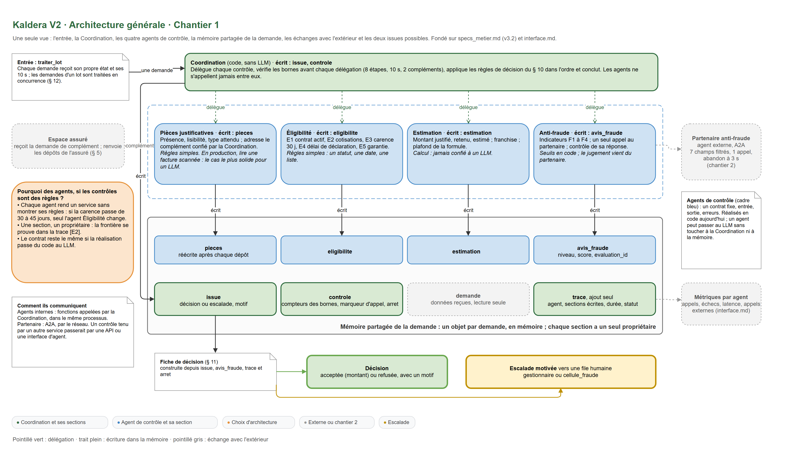
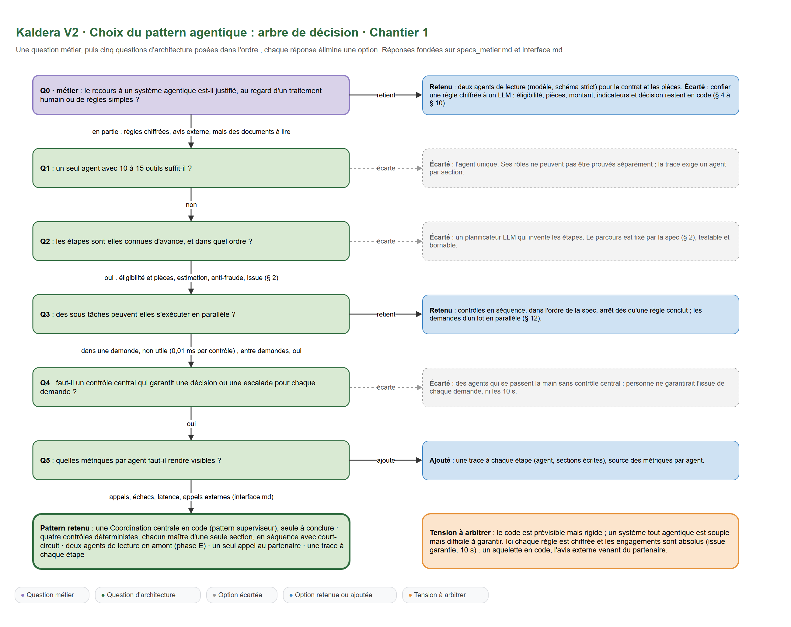
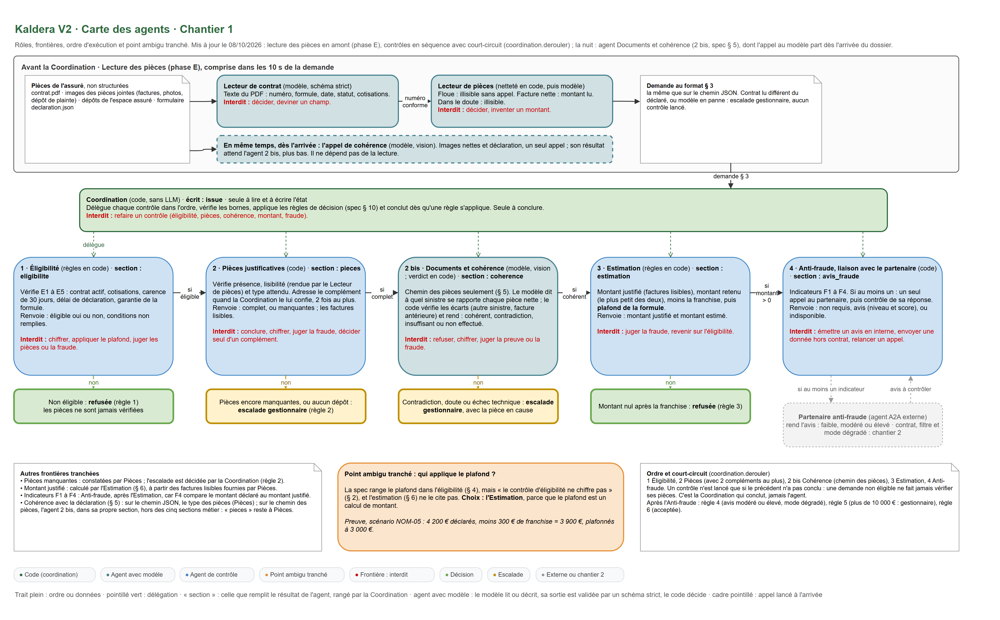
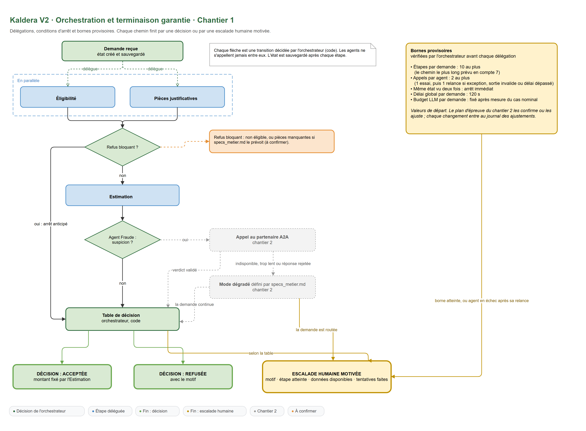

# Chantier 1 : l'équipe et son orchestration

Ce que le brief attend pour ce chantier : l'architecture générale de l'équipe, la carte des agents (rôles, frontières dont le point ambigu tranché, dépendances, parallélisme), le schéma d'orchestration (délégations, conditions d'arrêt, bornes provisoires) et le modèle de la mémoire partagée.

Exigences concernées : E1, E2 et E6, plus E3 pour les champs sensibles de la mémoire. Le détail des exigences est dans le [README](README.md).

Sources : [`docs/specs_metier.md`](docs/specs_metier.md) (version 3.2), [`docs/interface.md`](docs/interface.md), [`eval/scenarios.jsonl`](eval/scenarios.jsonl) (28 scénarios) et [`external_agent/contrat.md`](external_agent/contrat.md) (version 2.0), reçus le 06/10/2026. Les renvois « § » désignent les sections de `specs_metier.md`.

> **Attention aux noms.** La spec nomme **E1 à E5** les cinq conditions d'éligibilité (§ 4). Dans ce dossier, **[E1] à [E6]** entre crochets désignent les exigences de la direction des opérations (README). Ce ne sont pas les mêmes.

Démarche : le cadrage métier (section 1) précède le choix du pattern (section 2) et la conception de l'équipe (sections 3 à 6). Une architecture définie avant le cadrage risque d'optimiser ce qui n'en a pas besoin.

## 1. Cadrage métier

Avant toute conception technique, un cadrage avec le métier établit les contraintes réelles du système, en trois volets : l'analyse de l'existant, l'expression du besoin et les résultats attendus. Les documents reçus répondent à une partie des questions ; les autres restent à poser au client.

### Analyse de l'existant

- [ ] Le système actuel a-t-il déjà donné satisfaction ? Si oui, depuis quand ses performances se dégradent-elles, et quels indicateurs ou quelles traces l'attestent ?
  **Ouvert.** Les documents ne donnent ni historique ni indicateur de l'agent actuel. *Impact : la situation de référence à laquelle comparer la nouvelle équipe.*
- [ ] De quels indicateurs et de quelles traces dispose-t-on aujourd'hui (journaux, tableaux de bord, suivi LLMOps ou MLOps) ?
  **Ouvert** pour l'existant. Pour la cible, `interface.md` impose une trace par étape et quatre métriques par agent (section 6). *Impact : les sources réutilisables pour l'observabilité.*
- [ ] Pour quelles raisons l'agent généraliste actuel a-t-il été conçu ainsi ?
  **Ouvert.** *Impact : les contraintes implicites à conserver ou à lever.*
- [ ] Quel est le volume de demandes (moyenne journalière, pics) ? Combien sont bloquées aujourd'hui, et à quelle étape ?
  **Ouvert.** Les scénarios traitent des lots de 3 et 5 demandes, et le traitement d'une demande ne doit jamais être retardé par celui d'une autre (§ 12). *Impact : le parallélisme entre demandes et les bornes.*
- [x] Quel est le parcours réel d'une demande, de sa réception au remboursement ?
  **Réponse (§ 2).** Éligibilité, pièces justificatives, estimation, contrôle anti-fraude (seulement si un indicateur de risque est présent), puis une issue : décision acceptée ou refusée, ou escalade vers une file humaine. Le seul temps d'attente prévu est la demande de complément de pièces à l'assuré (§ 5).

### Expression du besoin

- [x] Le recours à un système agentique est-il justifié, au regard d'un traitement humain ou d'un système déterministe plus simple ? Pour quelles étapes ?
  **Réponse.** Toutes les règles sont chiffrées (§ 4 à § 10) : elles s'écrivent en code et se testent. L'avis anti-fraude vient d'un agent externe, le partenaire. Aucune règle n'exige de LLM, et la description libre du sinistre n'entre dans aucune règle. **Choix : aucun LLM dans le chemin de décision.** Un LLM pourrait au plus rédiger le motif lisible de la fiche (§ 11), hors décision ; des modèles de phrases suffisent par défaut.
- [x] Le partenaire anti-fraude externe est-il indispensable, ou un contrôle interne pourrait-il le remplacer ?
  **Réponse (§ 2).** « L'avis de fraude est émis par le partenaire, jamais en interne. » Le partenaire est imposé ; son indisponibilité est traitée par le mode dégradé (§ 9, chantier 2).
- [x] Les règles métier (éligibilité, plafonds, pièces exigées) sont-elles formalisées ? Qui les fait évoluer, et à quelle fréquence ?
  **Réponse en partie.** Elles sont formalisées dans la spec, version 3.2. Qui les fait évoluer reste **ouvert**. **Choix :** les seuils (30 jours, 5 000 €, 90 jours, 20 %, 1 500 €, 10 000 €, franchises et plafonds) sont regroupés dans une configuration qui porte le numéro de version de la spec, pour qu'un changement de règle ne touche pas le code des agents.
- [x] Un refus peut-il être prononcé de façon entièrement automatisée, ou doit-il être validé par un gestionnaire de sinistres ?
  **Réponse (§ 10).** La spec prévoit des refus automatiques : demande non éligible (règle 1) et montant estimé nul (règle 3), avec un motif. **Point à faire valider** par le service juridique du client : l'article 22 du RGPD encadre les décisions fondées exclusivement sur un traitement automatisé.
- [ ] Quelle erreur coûte le plus au métier : indemniser une fraude, ou refuser à tort une demande légitime ?
  **Ouvert**, mais la spec donne un indice : en mode dégradé, une demande de 1 500 € ou moins continue sans avis anti-fraude (§ 9). Le métier accepte donc un risque de fraude limité pour ne pas bloquer les petites demandes.
- [ ] Quelle équipe traite les escalades, et quelle est sa capacité de traitement journalière ?
  **Réponse en partie.** Deux files humaines : `gestionnaire` et `cellule_fraude` (§ 8). Leur capacité reste **ouverte**. *Impact : le taux d'escalade acceptable.*

### Résultats attendus

- [x] Quel délai de décision vise-t-on pour une demande ?
  **Réponse (§ 12).** Une issue en 10 secondes au plus de traitement automatisé, y compris quand le partenaire est lent, indisponible ou répond de manière non conforme.
- [ ] Quels indicateurs mesureront le succès à trois mois ?
  **Ouvert** pour le métier. Côté équipe, les métriques par agent sont fixées par `interface.md` (section 6).
- [x] Quelles décisions et quelles traces doivent être conservées, et qui en assure l'audit ?
  **Réponse en partie.** Chaque demande produit une fiche de décision (§ 11) avec sa trace et, s'il y a lieu, l'identifiant d'évaluation du partenaire, « à conserver pour audit » (contrat § 3). La durée de conservation et le responsable de l'audit restent **ouverts**.

Encore à recevoir : les tests d'acceptance (`tests/acceptance/`) et le pilote du partenaire simulé (`scripts/partner_ctl.py`), cités par `interface.md` mais absents de l'archive.

## 2. Le choix du pattern : l'arbre de décision

Les questions se posent dans l'ordre, et chaque réponse élimine une option. Q0 est issue de l'expression du besoin (section 1) ; Q1 à Q5 portent sur l'architecture (voir le schéma 0).

| # | Question | Réponse | Ce qu'elle écarte ou ajoute |
|---|---|---|---|
| Q0 | Le recours à un système agentique est-il justifié, au regard d'un traitement humain ou de règles simples ? | En partie : les règles sont chiffrées (§ 4 à § 10), l'avis de fraude vient d'un agent externe | Écarte : confier une règle à un LLM. Éligibilité, pièces, montant, indicateurs et décision restent en code |
| Q1 | Un seul agent avec 10 à 15 outils suffit-il ? | Non | Écarte : l'agent unique. `interface.md` exige qu'un agent n'écrive qu'une seule section métier ; c'est aussi le défaut de l'agent actuel |
| Q2 | Les étapes sont-elles connues d'avance, et dans quel ordre ? | Oui : éligibilité et pièces, estimation, anti-fraude, issue (§ 2) | Écarte : un planificateur LLM qui invente les étapes. Le parcours est fixé par la spec, testable et bornable |
| Q3 | Des sous-tâches peuvent-elles s'exécuter en parallèle ? | Oui : éligibilité et vérification des pièces | Retient : ces deux contrôles en parallèle ; la demande de complément seulement si la demande est éligible |
| Q4 | Faut-il un contrôle central qui garantit une décision ou une escalade pour chaque demande ? | Oui | Écarte : des agents qui se passent la main sans contrôle central ; personne ne garantirait l'issue de chaque demande, ni les 10 secondes |
| Q5 | Quelles métriques par agent faut-il rendre visibles ? | Appels, échecs, latence, appels externes (`interface.md`) | Ajoute : une trace à chaque étape (agent, sections écrites), source des métriques |

Pattern retenu : une Coordination centrale écrite en code (pattern superviseur) qui délègue chaque contrôle et applique les règles de décision, et quatre agents de contrôle, chacun maître d'une seule section ; éligibilité et pièces en parallèle ; un seul appel au partenaire par demande ; une trace à chaque étape.

La tension à arbitrer : le code déterministe est prévisible mais peu flexible ; un système tout agentique est flexible mais difficile à garantir. Ici chaque règle est chiffrée et les engagements sont absolus (une issue pour chaque demande, 10 secondes, données limitées au contrat). D'où le choix : un squelette en code, l'avis externe venant du partenaire.

Questions associées :

- [x] Un seul spécialiste suffit-il pour chaque demande, ou faut-il en combiner plusieurs ?
  **Réponse.** Chaque demande passe par plusieurs contrôles, dans l'ordre de la spec ; le contrôle anti-fraude n'appelle le partenaire que si un indicateur est présent.
- [x] Qui décide de la suite : le code, une boucle, un superviseur, ou les agents se vérifient-ils eux-mêmes ? [E1] [E6]
  **Réponse.** La Coordination, en code. Les agents ne s'appellent jamais entre eux et ne choisissent pas l'étape suivante.

## 3. La carte des agents [E2]

### Rôles et frontières

- [x] Quels sont exactement les agents ?
  **Réponse.** Cinq, un par section métier de `interface.md` : **Éligibilité** (`eligibilite`), **Pièces justificatives** (`pieces`), **Estimation** (`estimation`), **Anti-fraude**, liaison avec le partenaire (`avis_fraude`), et la **Coordination** (`issue`). « Une section métier n'est écrite que par un seul agent, et un agent n'écrit qu'une seule section métier. »
  Le brief cite quatre agents (éligibilité, pièces, estimation, coordination). `interface.md` en impose un cinquième : il y a cinq sections métier, un agent par section, et la Coordination écrit déjà `issue`. La section `avis_fraude` revient donc à un agent de liaison avec le partenaire. Cet agent n'émet aucun avis : il calcule les indicateurs, appelle le partenaire et contrôle sa réponse.
- [x] Sous quel nom chaque agent apparaît-il dans la trace ?
  **Réponse.** Un nom fixe par agent, utilisé dans le champ `agent` de la trace et comme clé des métriques de `traiter_lot` (`interface.md`) : `coordination`, `eligibilite`, `pieces`, `estimation`, `antifraude`. Changer un nom casserait la lecture des métriques.
- [x] Pour chaque agent : que peut-il faire, et que ne doit-il surtout pas faire ?
  **Réponse :** voir la carte des agents en fin de section et le schéma 1. Les frontières viennent du § 2 : l'éligibilité ne chiffre pas, l'estimation ne se prononce pas sur la fraude, l'avis de fraude vient du partenaire, seule la décision conclut.
- [x] Les outils sont-ils partagés entre agents, ou chacun a-t-il les siens ?
  **Réponse.** Chacun les siens. Seul l'agent Anti-fraude dispose du client du partenaire et du jeton d'accès (`PARTENAIRE_JETON`) ; seul l'agent Pièces peut adresser une demande de complément à l'espace assuré.
- [x] Qui rend la décision finale, et qui rédige le motif ?
  **Réponse.** La Coordination, qui écrit la section `issue` en appliquant les règles du § 10 dans l'ordre, et rédige le motif destiné à l'assuré ou au gestionnaire (§ 11).
- [x] Comment prouver par un test qu'un agent ne sort pas de son rôle ?
  **Réponse.** Deux preuves. La trace : pour chaque étape, `ecrit` liste les sections écrites ; un test vérifie que chaque agent n'écrit que sa section, sur les 28 scénarios. Et un test unitaire : un agent qui tente d'écrire la section d'un autre reçoit une erreur de droits.

### Le contrat de chaque agent

Il s'agit du contrat interne entre agents, distinct d'un contrat d'API : l'entrée, la sortie, les erreurs possibles et une docstring qui dit en une phrase le rôle et la frontière de l'agent.

Exemple, pour l'agent Éligibilité :

```python
def verifier_eligibilite(demande: Demande) -> ResultatEligibilite:
    """Dit si le contrat couvre le sinistre (conditions E1 à E5 de la spec, § 4).

    Ne calcule aucun montant, n'applique pas le plafond, ne juge ni les pièces ni la fraude.
    Erreurs : DonneesIncompletes.
    """
```

| Agent | Entrée | Sortie | Erreurs possibles | Docstring (une phrase) |
|---|---|---|---|---|
| Éligibilité | contrat et sinistre de la demande | éligible oui ou non ; conditions non remplies | données incomplètes | Dit si le contrat couvre le sinistre, sans chiffrer |
| Pièces justificatives | pièces, type de sinistre, dépôts de l'espace assuré | complet, ou pièces manquantes ou illisibles ; factures lisibles ; compléments demandés | données incomplètes | Dit si les pièces exigées sont présentes, lisibles et du type attendu, et demande les compléments quand la Coordination le lui confie, sans conclure la demande |
| Estimation | montant déclaré, formule, factures lisibles | montant justifié, montant retenu, montant estimé | données incomplètes | Calcule le montant remboursable, franchise et plafond compris, sans juger la fraude |
| Anti-fraude | champs utiles de la demande, montant justifié | non requis ; ou avis (niveau, score, indicateurs, `evaluation_id`) ; ou indisponible avec la raison | délai dépassé, erreur du service, réponse non conforme : toutes rendent « indisponible », jamais une exception | Calcule les indicateurs F1 à F4 et, si l'un est présent, obtient l'avis du partenaire en un seul appel, sans jamais émettre d'avis lui-même |
| Coordination | toutes les sections | section `issue` ; fiche de décision | borne atteinte, agent en échec : toutes deux mènent à une escalade motivée | Délègue chaque contrôle, applique les règles de décision dans l'ordre et conclut, sans refaire aucun contrôle |

### Garde-fous et métriques de bon fonctionnement, par agent

| Agent | Garde-fou | Métrique de bon fonctionnement |
|---|---|---|
| Éligibilité | le motif cite chaque condition non remplie ; aucun accès au montant | échecs ; refus par condition (NOM-02, NOM-03, NOM-04, NOM-10, NOM-11 en couvrent chacune une) |
| Pièces justificatives | demandes de complément bornées (2 au plus) ; une demande de complément n'est faite que sur délégation de la Coordination, après le résultat de l'Éligibilité | part des demandes avec complément ; échecs |
| Estimation | le montant n'est jamais négatif, jamais supérieur au plafond de la formule, arrondi au centime (NOM-05 le vérifie) | échecs ; latence |
| Anti-fraude | filtre sortant en liste blanche ; un seul appel par dossier (marqueur écrit par la Coordination avant la délégation) ; abandon à 3 s ; réponse contrôlée avant usage (chantier 2) | appels externes, réponses écartées, part des demandes en mode dégradé |
| Coordination | bornes vérifiées avant chaque délégation ; seule à écrire `issue` | étapes consommées par demande, bornes atteintes (`arret`), part d'escalades |

### Le point ambigu

Le brief demande de le trancher, et il sera questionné à la validation du dossier.

- [x] Quel est le point ambigu entre deux agents, et qui en est le seul responsable ?
  **Réponse : le plafond de garantie.** La spec le range dans la section éligibilité (§ 4), mais « le contrôle d'éligibilité ne chiffre pas la demande » (§ 2), et la section estimation (§ 6) ne le cite pas. **Choix : l'Estimation l'applique**, parce que le plafond est un calcul de montant. Le scénario NOM-05 le confirme : 4 200 € déclarés, moins 300 € de franchise, soit 3 900 €, plafonnés à 3 000 € remboursés.
- [x] Qui déclenche le contrôle anti-fraude qui mène à l'appel du partenaire ?
  **Réponse (§ 7).** Il n'y a pas de « suspicion » à juger : le contrôle est requis dès qu'un des quatre indicateurs F1 à F4 est présent. L'agent Anti-fraude les calcule, après l'Estimation, car F4 compare le montant déclaré au montant justifié.

Autres frontières tranchées :

| Responsabilité | Agents qui pourraient la revendiquer | Choix et raison |
|---|---|---|
| Appliquer le plafond | Éligibilité, Estimation | Estimation (point ambigu ci-dessus) |
| Escalader pour pièces manquantes | Pièces, Coordination | Pièces le constate ; la Coordination escalade (règle 2), car « seule la décision conclut la demande » (§ 2) |
| Calculer le montant justifié | Pièces, Estimation | Estimation (§ 6), à partir des factures lisibles fournies par Pièces |
| Un montant déclaré supérieur aux factures | Pièces (« cohérence avec la déclaration », § 5), Anti-fraude (F4, § 7) | Anti-fraude, par l'indicateur F4 ; ce n'est pas un motif de demande de complément. Le scénario AF-06 le confirme : 2 000 € déclarés, 1 500 € justifiés, demande acceptée avec un avis faible |
| La « cohérence avec la déclaration » (§ 5) | Pièces, Anti-fraude | Pièces vérifie que les pièces sont du type exigé pour le type de sinistre déclaré (une photo pour un dégât des eaux, un dépôt de plainte pour un vol). Une pièce ne porte que `type`, `lisible` et `montant` (§ 3) ; l'écart de montant relève de F4 |
| Décider d'une demande de complément | Pièces, Coordination | La Coordination, après le résultat de l'Éligibilité ; Pièces l'adresse à l'assuré. Pièces ne lit pas `eligibilite` |

### Dépendances et parallélisme

- [x] Quelles étapes dépendent les unes des autres, et lesquelles peuvent s'exécuter en parallèle ?
  **Réponse.** Éligibilité et vérification des pièces sont indépendantes et tournent en parallèle. La demande de complément, elle, attend l'Éligibilité : la Coordination ne la confie à Pièces que si la demande est éligible. L'Estimation attend les factures lisibles de Pièces. L'Anti-fraude attend l'Estimation (F4). La Coordination conclut en dernier. L'appel au partenaire n'est jamais lancé plus tôt : appeler pour une demande qui sera refusée gaspillerait l'unique appel autorisé et enverrait des données sans nécessité.
- [x] Quand deux résultats obtenus en parallèle se contredisent (par exemple : éligible, mais pièces incomplètes), quelle règle l'emporte ?
  **Réponse.** L'ordre des règles du § 10 : la première qui s'applique fixe l'issue. Une demande non éligible est refusée quel que soit l'état de ses pièces (règle 1), et la demande de complément n'est alors jamais adressée à l'assuré.

### Règle métier ou jugement : ce que fait chaque agent

Dans ce dossier, un agent est une unité de responsabilité : un rôle, un contrat (entrée, sortie, erreurs) et une seule section de la mémoire. Sa réalisation interne peut être du code ou un LLM ; la Coordination ne voit que le contrat.

| Agent | Contrôles | Nature | Où un LLM aurait du sens, en production | Place dans l'architecture et la mémoire |
|---|---|---|---|---|
| Éligibilité | E1 contrat actif, E2 cotisations à jour, E3 carence de 30 jours, E4 déclaration sous 30 jours (5 pour un vol), E5 garantie de la formule | règles simples : un statut, une date, une liste | aucun | écrit `eligibilite`, lue par la Coordination (règle 1) ; tourne en parallèle de Pièces |
| Pièces justificatives | présence, lisibilité, type attendu ; demande de complément | présence et type : règles. Lisibilité : fournie par un champ dans les scénarios (`lisible`, § 3) | lire une facture scannée, vérifier qu'une photo montre bien le sinistre déclaré : le cas le plus solide pour un LLM | écrit `pieces`, seule section réécrite après chaque dépôt ; fournit les factures lisibles à l'Estimation |
| Estimation | montant justifié, retenu, estimé ; franchise ; plafond | calcul | aucun : un montant calculé par un LLM serait un risque | écrit `estimation` ; fournit le montant justifié à l'Anti-fraude (F4) |
| Anti-fraude | indicateurs F1 à F4 ; un appel au partenaire ; contrôle de la réponse | F1 à F4 : des seuils. L'avis : un jugement, rendu par le partenaire | le jugement existe déjà, chez le partenaire | écrit `avis_fraude` ; seul agent qui sort du système ; ne voit ni l'identité ni l'IBAN |
| Coordination | bornes, règles du § 10 dans l'ordre, issue, motif | règles ordonnées | rédiger le motif lisible (§ 11), hors décision | écrit `issue` et `controle` ; seule à conclure |

**Pourquoi garder des agents alors que les contrôles sont des règles ?**

1. Chaque agent rend un service sans montrer ses règles. La Coordination demande « cette demande est-elle éligible ? » et reçoit oui ou non avec les conditions non remplies, sans connaître les seuils. Si le métier passe la carence de 30 à 45 jours, seul l'agent Éligibilité change. Le partenaire anti-fraude fonctionne déjà ainsi : il rend un avis sans révéler son modèle.
2. La frontière se prouve : une section, un propriétaire, vérifié dans la trace sur les 28 scénarios [E2].
3. Le contrat ne change pas si la réalisation change. L'agent Pièces peut passer au LLM sans toucher la Coordination ni la mémoire. Trois choses changent alors : un budget de tokens (aujourd'hui « sans objet », section 4), une validation de sa sortie, et la règle « pas de relance », qui suppose un code déterministe.
4. Les métriques se lisent par agent (appels, échecs, latence), sous un nom fixe (`interface.md`).

**Comment les agents communiquent.** Ici, les agents internes sont des fonctions appelées par la Coordination, dans le même processus : une seule équipe les maintient, et c'est le plus sûr pour tenir 10 s. Si un contrôle appartenait à un autre service de l'entreprise, il serait exposé par une API ou une interface d'agent, comme le partenaire en A2A. Ce choix dépend de l'organisation, pas des règles de décision.

Le schéma A montre cette architecture générale sur une seule vue.

### La carte des agents

| Agent | Rôle | Reçoit | Renvoie | Ne fait jamais | Code ou LLM |
|---|---|---|---|---|---|
| Coordination | délègue, vérifie les bornes, applique les règles du § 10, conclut | toutes les sections | `issue`, fiche de décision | refaire un contrôle | code |
| Éligibilité | conditions E1 à E5 de la spec | contrat, sinistre | éligible, conditions non remplies | chiffrer, appliquer le plafond, juger les pièces ou la fraude | code |
| Pièces justificatives | présence, lisibilité, type attendu des pièces ; demandes de complément confiées par la Coordination | pièces, dépôts de l'espace assuré | complet ou manquantes, factures lisibles | conclure ou escalader, chiffrer, juger la fraude, décider seul d'une demande de complément | code |
| Estimation | montant justifié, retenu, estimé ; franchise et plafond | montant déclaré, formule, factures lisibles | montants | juger la fraude, revenir sur l'éligibilité | code |
| Anti-fraude | indicateurs F1 à F4 ; un appel au partenaire ; contrôle de la réponse | champs utiles de la demande, montant justifié | non requis, avis ou indisponible | émettre un avis en interne, envoyer une donnée hors contrat, relancer un appel | code |

## 4. L'orchestration et la terminaison garantie [E1] [E6]

- [x] Quel schéma d'orchestration : superviseur qui délègue, chaîne séquentielle, mixte ?
  **Réponse : mixte.** Un superviseur, la Coordination, délègue chaque contrôle ; les deux premiers tournent en parallèle, la suite s'enchaîne dans l'ordre de la spec. Les agents ne s'appellent jamais entre eux.
- [x] Qui décide qu'une demande est terminée ?
  **Réponse.** La Coordination seule, en écrivant la section `issue` (« seule la décision conclut la demande », § 2). Elle applique les règles du § 10 dans l'ordre ; la première qui s'applique fixe l'issue.
- [x] Quels sont les états finaux possibles ?
  **Réponse (§ 2, § 11).** Deux issues seulement : une **décision** (acceptée ou refusée) ou une **escalade** vers `gestionnaire` ou `cellule_fraude`, avec un motif lisible. Il n'existe pas d'état « en attente » sans qu'un humain en ait été saisi. Le schéma 2 montre que chaque chemin mène à l'une de ces issues.
- [x] Comment borne-t-on les boucles ?
  **Réponse.** Une seule boucle existe dans le parcours : la demande de complément de pièces, qui reprend le contrôle après chaque dépôt de l'assuré (§ 5). Elle est bornée par le nombre de compléments, par la détection d'un état déjà vu et par les bornes globales (étapes et durée).
- [x] Qu'est-ce qu'une étape ?
  **Réponse.** Une délégation de la Coordination à un agent, soit une ligne de trace. Une demande de complément, avec la lecture du dépôt de l'assuré et le nouveau contrôle des pièces, compte pour une étape. L'écriture de l'issue par la Coordination est la dernière étape.
- [x] Quelles bornes au départ, et sur quelle base les choisit-on ?
  **Réponse :** voir le tableau ci-dessous. La durée vient de l'engagement de service ; le nombre d'étapes vient du chemin le plus long prévu par la spec et les scénarios ; le délai du partenaire vient de son contrat.
- [x] Que se passe-t-il quand une borne est atteinte ?
  **Réponse.** Jamais un arrêt silencieux. La demande reçoit une issue, une escalade vers `gestionnaire`, et sa fiche le signale dans `arret` avec le nom de la borne (`interface.md`). La file de destination n'est pas fixée par la spec, et le scénario BCL-01 ne vérifie que l'escalade et l'arrêt signalé : **choix à confirmer** avec le client.
  Pour que la trace ne dépasse jamais `etapes_max` (`interface.md`), la Coordination ne délègue plus aucun contrôle dès que la trace atteint `etapes_max` moins une étape : la dernière est réservée à l'écriture de l'issue. De même, elle arrête de déléguer avant la fin des 10 s, en gardant le temps de produire la fiche.
- [x] Comment un lot de demandes est-il traité ?
  **Réponse (§ 12).** « Le traitement d'une demande n'est jamais retardé par celui d'une autre. » `traiter_lot` traite donc les demandes du lot **en concurrence**, chacune avec son propre état et sa propre durée de 10 s ; les fiches sont rendues dans l'ordre des demandes (`interface.md`). Traitées l'une après l'autre, trois demandes qui attendent chacune le partenaire jusqu'à 3 s (scénario PAN-02) retarderaient la troisième d'environ 6 s. Le plan d'épreuve mesure ce point sur PAN-01 et PAN-02.
- [x] Qu'est-ce qu'une escalade « motivée » ?
  **Réponse (§ 8).** Elle précise la file destinataire et un motif lisible par le gestionnaire qui reprend le dossier : la règle ou la borne en cause, et l'étape atteinte. La trace complète accompagne la fiche.
- [x] Que se passe-t-il quand un agent interne plante, renvoie un format invalide ou dépasse son délai ?
  **Réponse.** Les agents internes sont du code déterministe : relancer avec la même entrée redonnerait la même erreur. Pas de relance : escalade immédiate vers `gestionnaire`, motif « erreur interne » avec le nom de l'agent, et l'échec compte dans les métriques. L'appel au partenaire suit une autre règle, celle de son contrat : jamais de relance, et toute défaillance rend l'avis « indisponible » (chantier 2).
- [x] Quelle gestion d'erreur observable met-on en place dans le workflow ?
  **Réponse.** Chaque étape écrit une ligne de trace avec son statut ; chaque échec compte dans `echecs` ; chaque arrêt par une borne est signalé dans `arret`.

### Les bornes provisoires

Les valeurs fixées par la spec ou le contrat ne sont pas provisoires. Les autres sont des valeurs de départ : le plan d'épreuve du chantier 2 les confirme ou les ajuste, et chaque ajustement entre dans le journal (voir [chantier 2, section 10](chantier-2-a2a-epreuve.md)).

| Borne | Valeur de départ | Justification | Scénario d'épreuve qui la teste |
|---|---|---|---|
| Durée par demande (`duree_max_s`) | 10 s | engagement de service (§ 12), maximum autorisé par `interface.md`. Si la mesure montre qu'une demande arrêtée à 10 s dépasse l'engagement le temps de produire sa fiche, la borne descendra à 8 s | PAN-02 (partenaire lent) |
| Étapes par demande (`etapes_max`) | 8 | chemin nominal : 5 étapes (éligibilité, pièces, estimation, anti-fraude, issue) ; plus 2 demandes de complément, soit 7 pour le chemin le plus long ; plus 1 de marge. La dernière étape est toujours réservée à l'issue | BCL-01 (piège à boucle) |
| Demandes de complément par demande | 2 | NOM-07 et PAN-01 en demandent une ; aucun scénario n'en justifie davantage | BCL-01 |
| Même état vu deux fois | arrêt immédiat | une pièce toujours illisible après un nouveau dépôt ne fait pas avancer la demande | BCL-01 |
| Appels au partenaire par dossier | 1 exactement | contrat, § 6 : un seul appel, aucune relance, tout doublon est refusé et signalé | PAN-01, PAN-02, scénarios `invalide` |
| Délai d'un appel au partenaire | 3 s | contrat, § 5 : le client abandonne au plus tard 3 s après l'envoi | PAN-02 |
| Délai par contrôle interne | 1 s | contrôles en code, sans réseau ; une seconde laisse du temps à l'appel externe | cas nominal |
| Budget de tokens ou de coût | sans objet | aucun LLM dans le chemin de décision | (aucun) |

Lecture du scénario BCL-01 : la facture est illisible, et le seul dépôt de l'assuré est une facture tout aussi illisible. Ce n'est pas « aucun dépôt du type demandé » (§ 5), donc la spec demanderait un nouveau complément, sans fin. Le scénario attend une escalade avec `arret` : c'est la borne « même état vu deux fois » qui l'arrête, à la quatrième étape (éligibilité, pièces, demande de complément qui retrouve le même état, issue). Cette lecture sera vérifiée contre les tests d'acceptance quand ils seront fournis.

Les dépôts de l'espace assuré se lisent dans l'ordre : le premier dépôt répond à la première demande de complément, le deuxième à la deuxième (§ 3).

## 5. La mémoire partagée

Le brief demande une mémoire partagée de la demande, avec un état commun et un accès maîtrisé.

- [x] Que contient l'état partagé de la demande ?
  **Réponse.** La demande reçue (§ 3), en lecture seule ; les cinq sections métier (`eligibilite`, `pieces`, `estimation`, `avis_fraude`, `issue`) ; une section de contrôle (compteurs des bornes, marqueur d'appel au partenaire, `arret`) ; la trace, en ajout seul.
- [x] Sous quelle forme, et où vit-elle ?
  **Réponse.** En mémoire, un objet par demande, créé au début de `traiter_demande` et jamais partagé entre deux demandes : le traitement d'une demande n'en retarde pas une autre (§ 12). À la fin, la fiche de décision est construite depuis `issue`, `avis_fraude`, la trace et `arret`.
- [x] Accès maîtrisé : qui lit et qui écrit quels champs ?
  **Réponse :** voir le tableau ci-dessous. Chaque agent écrit sa seule section ; il lit seulement ce dont il a besoin.
- [x] Comment un agent évite-t-il d'écraser le travail d'un autre ?
  **Réponse.** Une table fixe donne le propriétaire de chaque section ; toute écriture d'un agent dans une autre section est refusée par une erreur de droits. Seul le propriétaire écrit sa section, et il peut la réécrire à une étape suivante : `pieces` est mise à jour par Pièces après chaque dépôt de l'assuré ; les autres sections métier ne sont écrites qu'une fois. Éligibilité et Pièces, qui tournent en parallèle, écrivent dans des sections différentes : aucun conflit possible. La trace enregistre l'agent et les sections écrites à chaque étape, ce qui rend la règle vérifiable par un test.
- [x] Peut-on reprendre une demande après un crash, sans la bloquer de nouveau ?
  **Réponse.** Une demande se traite en 10 s au plus : en cas de crash, elle est reprise depuis le début, les contrôles en code donnant le même résultat. **Une exception, imposée par le contrat du partenaire** : un seul appel par dossier, et un doublon est signalé comme manquement. La Coordination écrit donc le marqueur « appel au partenaire délégué » dans `controle` juste avant de déléguer l'appel ; à la reprise, un marqueur sans avis rend l'avis « indisponible » (mode dégradé), et le partenaire n'est jamais rappelé.
- [x] Quels champs de la mémoire ne doivent jamais partir chez le partenaire ? [E3]
  **Réponse (contrat, § 2).** L'identité et les coordonnées de l'assuré (nom, prénom, e-mail, téléphone, adresse, code postal complet), l'IBAN, l'identifiant client et le numéro de contrat, la description libre du sinistre, les pièces et leur contenu. Seuls sept champs partent, construits par l'agent Anti-fraude (chantier 2).
- [x] Où range-t-on l'identifiant de l'évaluation du partenaire ?
  **Réponse.** Dans la section `avis_fraude` : niveau, score, indicateurs, `evaluation_id` (à conserver pour audit, contrat § 3) et version du modèle. Le contrat ne prévoit qu'un appel `message/send` qui renvoie une tâche terminée : pas d'identifiant de tâche à suivre ni à annuler.

### Les droits sur la mémoire

| Section de l'état | Écrite par | Lue par |
|---|---|---|
| `demande` (données reçues) | à la création, puis lecture seule | Éligibilité (contrat, sinistre) ; Pièces (pièces, sinistre, espace assuré) ; Estimation (montant déclaré, formule) ; Anti-fraude (sinistre, dates, historique, code postal pour le département) ; Coordination |
| `eligibilite` | Éligibilité | Coordination |
| `pieces` | Pièces | Estimation (factures lisibles), Coordination |
| `estimation` | Estimation | Anti-fraude (montant justifié), Coordination |
| `avis_fraude` | Anti-fraude | Coordination |
| `issue` | Coordination | fiche de décision |
| `controle` : compteurs des bornes, marqueur d'appel au partenaire, `arret` | Coordination | Coordination |
| `trace` : une ligne par étape, ajout seul | chaque étape, au nom de l'agent qui la réalise | métriques, fiche de décision |

L'agent Anti-fraude ne lit ni l'identité de l'assuré, ni son IBAN, ni le contenu des pièces : il ne peut pas envoyer ce qu'il ne voit pas.

## 6. L'observabilité et le plan de preuve [E6]

Le partenaire peut être lent, en panne ou répondre de manière non conforme : chaque affirmation sur le comportement de l'équipe doit se prouver par une trace ou par un test.

- [x] Quel événement enregistre-t-on à chaque étape ?
  **Réponse (`interface.md`).** Une ligne de `trace` par étape : l'agent, les sections écrites (`ecrit`), puis l'action, la durée et le statut.
- [x] Quelles métriques par agent en découlent ?
  **Réponse (`interface.md`).** Pour chaque agent : `appels` (étapes réalisées), `echecs` (erreur, délai dépassé, réponse écartée), `latence_ms` (durée moyenne d'une étape), `appels_externes`. Elles sont renvoyées par `traiter_lot`.
- [x] Quels éléments observe-t-on au niveau de l'équipe et de son orchestration ?
  **Réponse.** Les étapes consommées par demande, les bornes atteintes (`arret`), la part d'escalades par file, la part des demandes traitées en mode dégradé.
- [x] Comment montrer qu'une demande a suivi le bon chemin ?
  **Réponse.** Par sa trace : la suite des agents et des sections écrites se compare au chemin attendu par les règles du § 10.
- [x] Comment prouver [E1] sur tous les scénarios ?
  **Réponse.** Un test rejoue les 28 scénarios de `eval/scenarios.jsonl` et vérifie que chaque fiche porte une issue (`decision` ou `escalade`), conforme au champ `attendu`, en 10 s au plus.
- [x] Comment prouver [E2] ?
  **Réponse.** Sur les mêmes rejeux, un test vérifie dans la trace que chaque section métier n'est écrite que par son agent propriétaire ; un test unitaire fait écrire un agent dans une autre section et attend une erreur de droits.

Le filtre des données sortantes, la validation des réponses du partenaire et le mode dégradé sont traités au [chantier 2](chantier-2-a2a-epreuve.md).

## 7. Cas d'usage : quatre demandes suivies de bout en bout

Chaque cas est un scénario de `eval/scenarios.jsonl`. Une étape est une délégation de la Coordination, soit une ligne de trace.

### Cas 1 : une pièce manquante, puis déposée (NOM-07, KAL-26-0107)

Situation : formule premium, dégât des eaux du 2 août 2026 déclaré le lendemain, 2 300 € déclarés ; facture lisible, photo absente ; l'assuré dépose une photo lisible après la demande de complément.

| Étape | Agent | Écrit | Résultat |
|---|---|---|---|
| 1 | eligibilite | eligibilite | éligible : les cinq conditions sont remplies |
| 2 | pieces | pieces | photo manquante |
| 3 | pieces, sur délégation de la Coordination | pieces (réécrite) | complément adressé, photo déposée, pièces complètes |
| 4 | estimation | estimation | justifié 2 300 €, franchise 0 €, estimé 2 300 € |
| 5 | antifraude | avis_fraude | aucun indicateur F1 à F4 : avis non requis, aucun appel |
| 6 | coordination | issue | règles 1 à 5 non applicables, règle 6 : acceptée |

Issue : décision acceptée, 2 300 € remboursés, sans avis ni mode dégradé. Ce que le cas montre : la boucle de complément, la réécriture de `pieces` par son seul propriétaire, la décision du complément par la Coordination après l'éligibilité.

### Cas 2 : un contrat résilié (NOM-02, KAL-26-0102)

Situation : formule essentiel, contrat au statut `resilie`, incendie de 2 400 € avec facture et photo.

| Étape | Agent | Écrit | Résultat |
|---|---|---|---|
| 1 | eligibilite | eligibilite | non éligible : condition E1 (contrat actif) non remplie |
| 2 | pieces | pieces | pièces complètes (contrôle mené en parallèle) |
| 3 | coordination | issue | règle 1 : refusée |

Issue : décision refusée, 0 €, le motif cite la condition E1. Ce que le cas montre : l'arrêt anticipé ; ni estimation, ni appel au partenaire, ni sollicitation de l'assuré.

### Cas 3 : le point ambigu, le plafond (NOM-05, KAL-26-0105)

Situation : formule essentiel (franchise 300 €, plafond 3 000 €), dégât des eaux de 4 200 € avec facture et photo.

| Étape | Agent | Écrit | Résultat |
|---|---|---|---|
| 1 | eligibilite | eligibilite | éligible |
| 2 | pieces | pieces | pièces complètes |
| 3 | estimation | estimation | retenu 4 200 €, moins 300 € = 3 900 €, plafonné à 3 000 € |
| 4 | antifraude | avis_fraude | aucun indicateur (4 200 € < 5 000 €) : avis non requis |
| 5 | coordination | issue | règle 6 : acceptée |

Issue : décision acceptée, 3 000 € remboursés. Ce que le cas montre : le plafond appliqué par l'Estimation, jamais par l'Éligibilité.

### Cas 4 : le piège à boucle (BCL-01, KAL-26-0601)

Situation : formule confort, dégât des eaux de 1 400 € ; la facture est illisible, et le seul dépôt de l'assuré est une facture tout aussi illisible.

| Étape | Agent | Écrit | Résultat |
|---|---|---|---|
| 1 | eligibilite | eligibilite | éligible |
| 2 | pieces | pieces | facture illisible |
| 3 | pieces, sur délégation de la Coordination | pieces (réécrite) | complément adressé, nouveau dépôt illisible : même état qu'à l'étape 2 |
| 4 | coordination | issue | borne « même état vu deux fois » : escalade gestionnaire |

Issue : escalade, `arret` renseigné avec le nom de la borne, trace de 4 étapes. Ce que le cas montre : la boucle arrêtée par une borne, jamais un blocage silencieux.

Les cas d'usage de la liaison avec le partenaire (avis faible, avis modéré, réponse écartée, partenaire lent) sont au [chantier 2, section 10](chantier-2-a2a-epreuve.md).

## Points ouverts

| Point | Pourquoi il reste ouvert | Qui tranche |
|---|---|---|
| File de l'escalade quand une borne est atteinte | la spec ne la fixe pas ; choix actuel : `gestionnaire` | le client |
| Refus automatiques (règles 1 et 3) | article 22 du RGPD | le service juridique du client |
| Lecture du scénario BCL-01 | dépôt illisible : la spec ne dit pas s'il compte comme un dépôt | les tests d'acceptance, absents de l'archive |
| Durée de 10 s ou 8 s | dépend du temps mesuré pour produire la fiche | le plan d'épreuve du chantier 2 |
| Attente réelle de l'assuré après une demande de complément | les 10 s portent sur le traitement automatisé (§ 12) ; dans les scénarios, les dépôts sont déjà dans `espace_assure`. En production, l'attente d'un dépôt qui peut prendre des jours n'est pas décrite | le client |

## Schémas

Fondés sur `specs_metier.md` (version 3.2) et `interface.md`. Restent provisoires : les valeurs des bornes, à éprouver au chantier 2, et la file de l'escalade sur borne atteinte. Chaque schéma existe en `.drawio`, modifiable sur [app.diagrams.net](https://app.diagrams.net/), et en `.png`. Ils se régénèrent avec `scripts/make_schemas_ch1.py`.

### A. L'architecture générale

Une seule vue : l'entrée `traiter_lot`, la Coordination, les quatre agents de contrôle et la section que chacun écrit, la mémoire partagée de la demande, l'espace assuré, le partenaire, les métriques et les deux issues possibles. Les deux encadrés de gauche résument pourquoi les contrôles restent des agents et comment ils communiquent (section 3). Fichiers : [schema-A-architecture-generale.drawio](schemas/schema-A-architecture-generale.drawio), [PNG](schemas/schema-A-architecture-generale.png).



### 0. Le choix du pattern : l'arbre de décision

Une question métier (Q0), puis cinq questions d'architecture posées dans l'ordre ; chaque réponse élimine une option, jusqu'au pattern retenu. Fichiers : [schema-0-arbre-de-decision.drawio](schemas/schema-0-arbre-de-decision.drawio), [PNG](schemas/schema-0-arbre-de-decision.png).



### 1. La carte des agents

Les cinq agents, la section que chacun écrit, ses interdits, le point ambigu tranché (le plafond) et les dépendances. Fichiers : [schema-1-carte-des-agents.drawio](schemas/schema-1-carte-des-agents.drawio), [PNG](schemas/schema-1-carte-des-agents.png).



### 2. L'orchestration et la terminaison garantie

Les règles de décision du § 10 dans l'ordre, la boucle de la demande de complément, le mode dégradé, les bornes ; chaque chemin finit par une décision ou une escalade motivée. Fichiers : [schema-2-orchestration.drawio](schemas/schema-2-orchestration.drawio), [PNG](schemas/schema-2-orchestration.png).



### 3. La mémoire partagée de la demande

Les sections, l'agent propriétaire de chacune, les droits de lecture, la règle d'écriture et le lieu de vie de l'état. Fichiers : [schema-3-memoire-partagee.drawio](schemas/schema-3-memoire-partagee.drawio), [PNG](schemas/schema-3-memoire-partagee.png).


