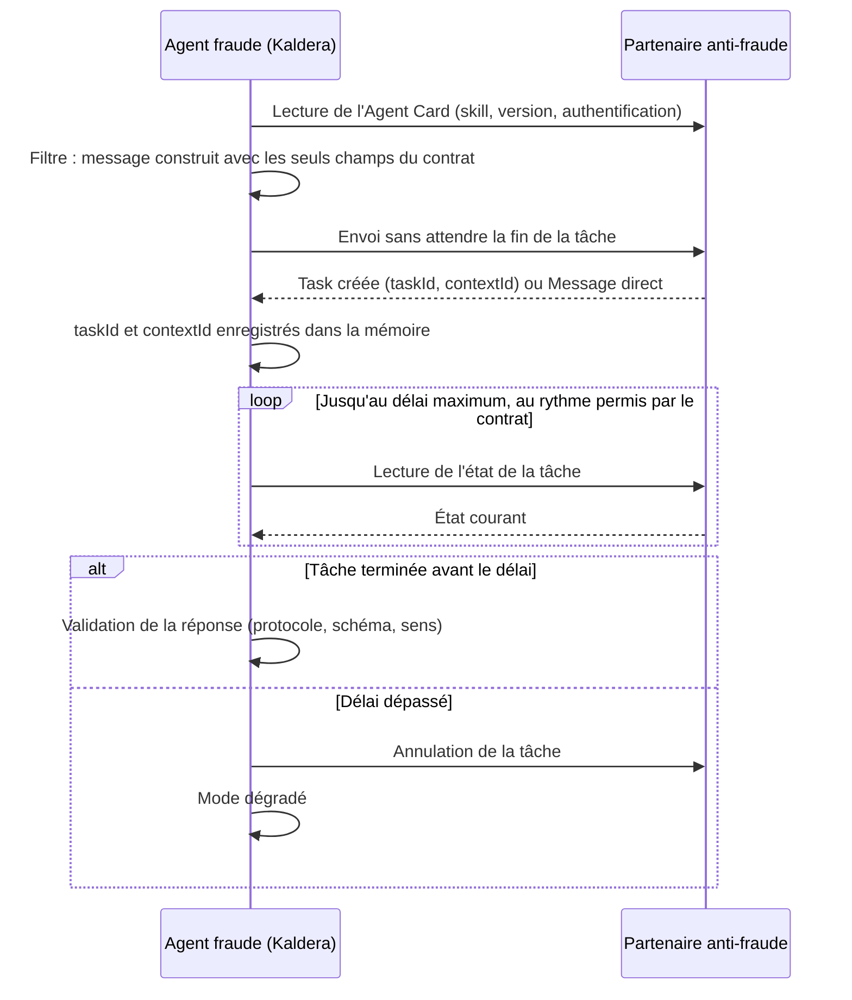
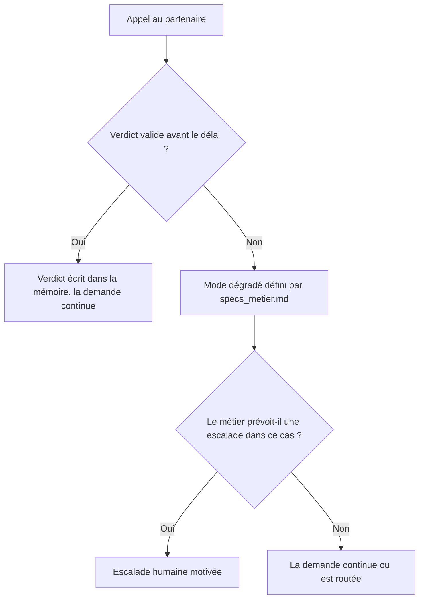

# Chantier 2 : la collaboration A2A et l'épreuve du réel

Ce que le brief attend pour ce chantier : le schéma d'échange A2A (contrat, filtre de données, validation des réponses, chemin de mode dégradé) et le plan d'épreuve (scénarios d'intégration × signaux observés × ajustement possible du chantier 1).

Exigences concernées : E3, E4, E5 et E6. Le brief résume l'enjeu en une ligne : le partenaire peut être lent, menteur ou en panne, et le contrat doit être respecté à la lettre.

Démarche : comme au chantier 1, le cadrage métier (section 1) précède les choix de conception (section 2, arbre de décision) et leur détail (sections 3 à 8) ; l'épreuve vient ensuite (sections 9 et 10).

## 1. Cadrage métier de la collaboration avec le partenaire

La liaison avec le partenaire se conçoit à partir du fonctionnement réel de la collaboration : son historique, ce que le métier attend d'elle, et ce qu'il accepte quand elle fait défaut. Chaque question précise son impact sur la conception.

### Analyse de l'existant

- [ ] Comment l'agent actuel interroge-t-il le partenaire, et que se passe-t-il aujourd'hui quand celui-ci ne répond pas ?
  *Impact sur la conception : les défaillances réelles à couvrir en priorité.*
- [ ] Combien de demandes partent chez le partenaire, avec quel délai de réponse moyen, et quelle part de pannes ou de lenteurs ?
  *Impact sur la conception : le délai par appel, les bornes, le dimensionnement du mode dégradé.*
- [ ] Le partenaire a-t-il déjà renvoyé des réponses erronées ou incohérentes ? Comment l'a-t-on détecté ?
  *Impact sur la conception : les contrôles de cohérence de la validation.*
- [ ] Quelles traces des échanges avec le partenaire sont conservées aujourd'hui ?
  *Impact sur la conception : les preuves disponibles et le contenu du journal.*

### Expression du besoin

- [ ] Le partenaire est-il indispensable, ou un contrôle interne pourrait-il le remplacer ?
  *Impact sur la conception : la place de l'échange A2A (question Q0 de l'arbre de décision, section 2).*
- [ ] Que prévoit exactement le contrat d'échange : champs autorisés, format, délais, nombre d'appels, règles de relance, coût par appel, version du protocole ?
  *Impact sur la conception : le filtre, la validation et la politique de relance.*
- [ ] Quelles données personnelles le partenaire peut-il recevoir, et dans quel cadre contractuel et réglementaire ?
  *Impact sur la conception : la liste blanche du filtre, au regard du principe de minimisation du RGPD.*
- [ ] Quand le partenaire est indisponible, que souhaite le métier : poursuivre la demande (par exemple sous un seuil de montant), la mettre en attente, ou la confier à un gestionnaire de sinistres ?
  *Impact sur la conception : le mode dégradé (E5).*
- [ ] Quel risque le métier accepte-t-il pendant une panne du partenaire : indemniser sans contrôle de fraude, ou différer les remboursements ?
  *Impact sur la conception : les seuils du mode dégradé.*
- [ ] Que faire d'une réponse du partenaire arrivée après une décision déjà prise ?
  *Impact sur la conception : le traitement des réponses tardives.*

### Résultats attendus

- [ ] Quel délai maximal d'attente du partenaire le métier accepte-t-il avant de basculer en mode dégradé ?
  *Impact sur la conception : le délai par appel.*
- [ ] Quels indicateurs suivront la collaboration : disponibilité du partenaire, latence, part de réponses rejetées, part de demandes traitées en mode dégradé ?
  *Impact sur la conception : les métriques du monitorage.*
- [ ] Comment le métier souhaite-t-il être alerté d'une panne prolongée ou d'un taux anormal de réponses rejetées ?
  *Impact sur la conception : les alertes et leurs seuils.*
- [ ] Quelles preuves faudra-t-il produire en cas de litige avec le partenaire : messages envoyés, réponses reçues, motifs de rejet ?
  *Impact sur la conception : le contenu du journal et sa durée de conservation.*

Éléments à recueillir auprès du client : le contrat du partenaire (schéma, délais, relances, version du protocole A2A), son Agent Card, la partie de `specs_metier.md` qui définit le mode dégradé et l'historique des incidents avec le partenaire.

## 2. Le choix de la liaison : l'arbre de décision

Les questions se posent dans l'ordre, et chaque réponse élimine une option. Q0 est issue de l'expression du besoin (section 1) ; Q1 à Q5 portent sur la conception de la liaison. Les réponses sont provisoires en attendant le contrat du partenaire et `specs_metier.md` (voir le schéma 4).

| # | Question | Réponse provisoire | Ce qu'elle écarte ou ajoute |
|---|---|---|---|
| Q0 | Le partenaire anti-fraude externe est-il indispensable, ou un contrôle interne suffirait-il ? | Oui (hypothèse du brief) | Écarte : un contrôle de fraude entièrement interne ; à confirmer lors du cadrage |
| Q1 | Le partenaire peut-il recevoir toutes les données de la demande ? | Non : seulement les champs du contrat | Retient : un filtre en liste blanche, message construit champ par champ et validé avant l'envoi (E3) |
| Q2 | Faut-il bloquer l'appel jusqu'à la réponse du partenaire ? | Non : envoi sans attente, puis lecture de l'état jusqu'au délai | Écarte : l'envoi avec attente, qui ne rend pas l'identifiant de la tâche si le délai expire, ce qui rend l'annulation impossible |
| Q3 | Peut-on relancer librement un appel en échec ? | Non : pas de relance sauvage | Écarte : les relances libres. Relances bornées par le contrat, sur les seules erreurs rejouables, avec un délai croissant |
| Q4 | Une réponse bien formée est-elle forcément fiable ? | Non : le partenaire peut mentir | Ajoute : une validation à trois niveaux (protocole, schéma, sens) ; toute réponse non conforme est rejetée (E4) |
| Q5 | Que fait la demande quand aucun verdict valide n'arrive ? | Mode dégradé selon `specs_metier.md` | Retient : une règle unique ; sans verdict valide, le mode dégradé défini par le métier s'applique (E5) |

Liaison retenue : un seul point de sortie (l'agent Fraude), un filtre en liste blanche, un envoi sans attente avec délai par appel et annulation, des relances bornées par le contrat, une validation à trois niveaux et un mode dégradé unique.

La tension à arbitrer : une validation stricte rejette davantage de réponses et sollicite plus souvent le mode dégradé ; une validation souple laisse passer des réponses douteuses. Choix : la rigueur sur la validation, la continuité de service assurée par le mode dégradé.

## 3. Le protocole A2A

### La version visée

La spécification a changé entre la version 0.3.0 et la version 1.0.0, la dernière publiée. Les noms ne sont pas les mêmes d'une version à l'autre. Le dossier doit donc dire laquelle il suit, et c'est le partenaire qui l'impose.

| Élément | Version 0.3.0 | Version 1.0.0 |
|---|---|---|
| Envoyer un message | `message/send` | `SendMessage` |
| Lire une tâche | `tasks/get` | `GetTask` |
| Annuler une tâche | `tasks/cancel` | `CancelTask` |
| États d'une tâche | `submitted`, `working`, `input-required`, `completed`, `canceled`, `failed`, `rejected`, `auth-required`, `unknown` | `TASK_STATE_SUBMITTED`, `TASK_STATE_WORKING`, `TASK_STATE_INPUT_REQUIRED`, `TASK_STATE_COMPLETED`, `TASK_STATE_CANCELED`, `TASK_STATE_FAILED`, `TASK_STATE_REJECTED`, `TASK_STATE_AUTH_REQUIRED`, `TASK_STATE_UNSPECIFIED` |
| Type d'une Part | champ `kind` : `text`, `file` ou `data` | champ `kind` supprimé |
| Champs obligatoires d'une Task | `id`, `contextId`, `kind`, `status` | `id`, `status` |
| Envoi sans attendre la fin de la tâche | `configuration.blocking: false` | `returnImmediately: true` |
| Où se lit la version du protocole | champ `protocolVersion` de l'Agent Card | paramètre de service `A2A-Version` |

Les exemples de ce document suivent la version 0.3.0. Ils seront à transposer si le partenaire suit la version 1.0.0.

### Les objets du protocole

- **Agent Card** : la fiche d'identité de l'agent. Elle dit ce qu'il sait faire (ses *skills*), quelle version du protocole il suit et comment s'authentifier. En version 0.3.0, l'emplacement recommandé est `/.well-known/agent-card.json`.
- **Task** : l'unité de travail, avec un identifiant et un état. Les tâches d'une même conversation partagent un `contextId`.
- **Message** : un tour de parole entre le client et l'agent, découpé en Parts.
- **Part** : un morceau de contenu, texte, fichier ou données JSON.
- **Artifact** : le résultat d'une tâche, lui aussi fait de Parts.

Une réponse à l'envoi d'un message peut être une Task ou directement un Message. Les deux cas doivent être prévus.

### L'échange appliqué à Kaldera

Un envoi qui attend la fin de la tâche ne rend la main qu'une fois la tâche terminée. Si notre délai expire avant, nous n'avons jamais reçu l'identifiant de la tâche : impossible de l'annuler, elle reste orpheline chez le partenaire. Pour pouvoir borner l'attente et annuler, l'agent fraude envoie sans attendre, enregistre l'identifiant dans la mémoire, puis lit l'état de la tâche jusqu'au délai maximum.



### Questions

- [ ] Quelle version du protocole le partenaire suit-il ?
- [ ] Que contient l'Agent Card du partenaire : quel skill, quelle version, quelle authentification ?
- [ ] Vérifie-t-on l'Agent Card au démarrage ? Que fait-on si le skill ou la version attendus manquent ?
- [ ] Quel mode d'échange choisit-on : envoi avec attente, envoi sans attente puis lecture de l'état, streaming, ou notification push ? Pourquoi ?
- [ ] À quel rythme peut-on lire l'état d'une tâche sans enfreindre le contrat ?
- [ ] Comment relie-t-on une tâche A2A à sa demande Kaldera ?

## 4. Le contrat d'échange [E3] [E4]

| Rubrique | Ce qu'il faut définir |
|---|---|
| Requête | Liste fermée des champs, avec type, format et caractère obligatoire. Exactement les champs du contrat, ni plus ni moins |
| Identifiants | Ce que le contrat prévoit : référence réelle ou pseudonyme. Pseudonymiser relève du contrat ; envoyer un pseudonyme là où le contrat attend une référence réelle le rompt |
| Réponse | Schéma de la partie données : identifiant de corrélation, verdict (liste fermée de valeurs), score (bornes), code motif |
| Délais | Délai par appel, budget total de l'étape anti-fraude, rythme de lecture de l'état |
| Relances | Erreurs rejouables (réseau, HTTP 503) ou non (réponse invalide, paramètres invalides `-32602`). Nombre maximum, délai croissant entre deux essais, respect de l'en-tête `Retry-After` |
| Doublons | Une relance peut créer une deuxième tâche chez le partenaire. Le partenaire dédoublonne-t-il sur le `messageId` ? |
| Version | Version du contrat dans le schéma, pour repérer un changement côté partenaire |

### Questions

- [ ] Quel est le contrat d'échange avec le partenaire anti-fraude (format, champs, délais, règles de relance) ?
- [ ] Quels champs exactement dans la requête, avec quel type et quel format, obligatoires ou non ?
- [ ] Le contrat attend-il une référence client réelle, ou autorise-t-il un pseudonyme ?
- [ ] Quel schéma attend-on en réponse ?
- [ ] Comment repère-t-on que le partenaire a changé la version de son contrat ?

### Exemples fictifs (format 0.3.0)

Les champs métier ci-dessous sont inventés. Les vrais viendront du contrat du partenaire. L'enveloppe A2A, elle, suit la version 0.3.0 : les quatre exemples ont été validés contre le schéma JSON officiel de cette version (lien dans le [README](README.md)).

Envoi de la demande, sans attendre la fin de la tâche :

```json
{
  "jsonrpc": "2.0",
  "id": "req-001",
  "method": "message/send",
  "params": {
    "message": {
      "kind": "message",
      "role": "user",
      "messageId": "msg-7f3a",
      "parts": [
        {
          "kind": "data",
          "data": {
            "claim_ref": "CLM-8842",
            "claim_type": "auto",
            "amount_claimed": 4200.00,
            "incident_date": "2026-09-12"
          }
        }
      ]
    },
    "configuration": { "blocking": false }
  }
}
```

Réponse immédiate : la tâche est créée, son identifiant est enregistré dans la mémoire.

```json
{
  "jsonrpc": "2.0",
  "id": "req-001",
  "result": {
    "kind": "task",
    "id": "task-123",
    "contextId": "ctx-8842",
    "status": { "state": "submitted" }
  }
}
```

Lecture de l'état de la tâche :

```json
{
  "jsonrpc": "2.0",
  "id": "req-002",
  "method": "tasks/get",
  "params": { "id": "task-123" }
}
```

Réponse une fois la tâche terminée :

```json
{
  "jsonrpc": "2.0",
  "id": "req-002",
  "result": {
    "kind": "task",
    "id": "task-123",
    "contextId": "ctx-8842",
    "status": { "state": "completed" },
    "artifacts": [
      {
        "artifactId": "art-1",
        "parts": [
          {
            "kind": "data",
            "data": {
              "claim_ref": "CLM-8842",
              "risk_level": "high",
              "score": 0.82,
              "reason_code": "R12"
            }
          }
        ]
      }
    ]
  }
}
```

## 5. Le filtre des données sortantes [E3]

- **Construire un objet neuf.** Le message ne contient que les champs du contrat, recopiés un par un. On ne part pas de la demande complète pour en retirer des champs : un champ ajouté plus tard à la demande passerait le filtre.
- **Valider avant l'envoi.** Le message sortant est vérifié contre le schéma du contrat, sans champ supplémentaire autorisé (`additionalProperties: false`). En cas d'échec, rien ne part.
- **Un champ en trop est une fuite.** Il est bloqué chez nous, avant l'envoi. Compter sur un refus du partenaire serait trop tard : la donnée serait déjà sortie.
- **Un seul point de sortie.** Seul l'agent fraude parle au partenaire, et seulement à travers ce filtre.
- **Des logs sans fuite.** On journalise ce qui est parti sans recopier les données sensibles dans les traces.
- **La preuve.** Un test glisse des données sensibles dans la mémoire de la demande et vérifie qu'elles n'apparaissent pas dans le message envoyé.

### Questions

- [ ] Quelles données ont le droit de partir chez le partenaire, et comment le filtre garantit-il que rien d'autre ne sort ?
- [ ] Liste blanche ou liste noire ? Que se passe-t-il quand un nouveau champ est ajouté plus tard à la demande ?
- [ ] Valide-t-on le message sortant contre le schéma du contrat avant de l'envoyer ?
- [ ] Un seul agent a-t-il le droit de parler au partenaire ?
- [ ] Nos logs et nos traces laissent-ils fuiter des données qu'on n'a pas le droit d'envoyer ?

## 6. La validation des réponses [E4]

| Niveau | Ce qu'on vérifie |
|---|---|
| Protocole | JSON-RPC valide, `id` identique à celui de la requête, réponse de type Task ou Message, état de tâche connu |
| Schéma | Partie données conforme au contrat, sans champ en trop, avec les bons types. Cette règle vise la partie données : l'enveloppe A2A porte légitimement des champs optionnels (historique, métadonnées) |
| Sens | `claim_ref` identique à celui envoyé, score dans ses bornes, verdict cohérent avec le score, code motif connu |

- Une réponse qui échoue à un seul niveau est rejetée et journalisée. Elle n'entre jamais dans la mémoire partagée.
- Une réponse de type Message, sans tâche, est acceptée si sa partie données respecte le contrat, et rejetée sinon.
- Seuls les champs structurés validés sont gardés. Un texte libre du partenaire n'est jamais injecté dans le prompt d'un autre agent, à cause du risque d'injection.

### Questions

- [ ] Qu'est-ce qu'une réponse non conforme, à chacun des trois niveaux ?
- [ ] Comment repère-t-on un partenaire « menteur », qui répond au bon format avec un contenu faux ?
- [ ] Que fait-on si le partenaire répond par un Message au lieu d'une tâche ?
- [ ] Une réponse rejetée mène-t-elle au mode dégradé ou à une escalade ?
- [ ] Garde-t-on le texte libre du partenaire ? Si oui, comment l'empêcher d'injecter des instructions dans le prompt d'un autre agent ?

## 7. Le mode dégradé [E5]

### Un principe avant les cas

Avant de traiter chaque situation, le dossier fixe une règle commune. Proposition à confronter à `specs_metier.md` : faute de verdict valide du partenaire, quelle qu'en soit la raison, la demande suit le mode dégradé défini par le métier. L'escalade humaine est réservée aux cas que `specs_metier.md` désigne et aux bornes atteintes. Une règle unique donne moins de branches, donc moins de tests, et une réponse plus simple à défendre.



### Questions

- [ ] Que dit `specs_metier.md` : la demande continue, ou elle est routée ? Si elle est routée, vers qui ?
- [ ] À partir de quand le partenaire est-il « indisponible » : délai dépassé, erreur, lenteur ? Avec quel délai ?
- [ ] « Pas de retry sauvage » : quelles erreurs rejoue-t-on, combien de fois, avec quel délai entre deux essais ?
- [ ] Faut-il un disjoncteur (*circuit breaker*) pour arrêter d'appeler un partenaire en panne ?
- [ ] Une relance peut-elle créer deux tâches chez le partenaire ?
- [ ] Annule-t-on la tâche chez le partenaire quand on passe en mode dégradé ?
- [ ] Que fait-on d'une réponse qui arrive après le passage en mode dégradé ?
- [ ] Quelle réaction pour chaque état d'échec ou d'interruption : `failed`, `rejected`, `auth-required`, `input-required` ? Avec `input-required`, le partenaire réclame plus de données, alors que rien ne doit sortir hors contrat.

### Tableau des situations

Réactions proposées, à confronter à `specs_metier.md`. Les états sont nommés selon la version 0.3.0.

| Situation | Ce qu'on observe | Réaction proposée |
|---|---|---|
| Cas nominal | `completed` et partie données valide | Verdict écrit dans la mémoire, la demande continue |
| Partenaire lent | Tâche non terminée au délai maximum | Annulation de la tâche, puis mode dégradé |
| Partenaire en panne | Erreur réseau, HTTP 5xx, aucune réponse | Relances bornées selon le contrat, puis mode dégradé |
| Réponse invalide | Échec au niveau protocole ou schéma | Rejet sans relance, puis mode dégradé |
| Partenaire menteur | Schéma conforme, sens incohérent | Rejet journalisé, puis mode dégradé |
| Refus | `rejected` ou `failed` | Mode dégradé |
| Demande d'informations | `input-required` | Rien n'est envoyé hors contrat : annulation, puis mode dégradé |
| Problème d'accès | `auth-required`, HTTP 401 ou 403 | Pas de relance, alerte technique, puis mode dégradé |
| Réponse tardive | Arrive après le passage en mode dégradé | Journalisée, sans changer la décision déjà prise |

## 8. L'observabilité et les preuves [E6]

Le brief impose trois métriques par agent : la latence, les échecs et le recours à l'externe. Le partenaire pouvant être lent, en panne ou de mauvaise foi, chaque échange doit aussi laisser une preuve vérifiable.

- [ ] Comment mesure-t-on chacune des trois métriques ?
- [ ] Où ces métriques sont-elles visibles : tableau de bord, logs, rapport ?
- [ ] Quels éléments observe-t-on au niveau de l'équipe et de son orchestration ?
- [ ] Comment montrer qu'une demande a suivi le bon chemin ?
- [ ] Quelles preuves conserve-t-on de chaque échange (message envoyé après filtrage, réponse reçue, résultat de la validation), sans recopier de données hors contrat dans les traces ?
- [ ] Quels garde-fous propres à la liaison A2A, et quelle métrique dit qu'elle fonctionne bien (disponibilité du partenaire, part de réponses rejetées, part de demandes en mode dégradé) ?

### Tableau à remplir : les métriques

| Métrique | Niveau | Source | Où elle est visible |
|---|---|---|---|
| Latence | Par agent | Journal d'événements | |
| Échecs | Par agent | Journal d'événements | |
| Recours à l'externe | Agent fraude | Journal d'événements | |
| Étapes par demande | Équipe | Compteurs de la mémoire | |
| Bornes atteintes | Équipe | Journal d'événements | |
| Passages en mode dégradé | Équipe | Journal d'événements | |

## 9. Le plan d'épreuve [E6]

- [ ] Comment vérifier automatiquement et rapidement que les specs sont respectées : tests d'acceptance fournis, tests d'intégration sur `eval/scenarios.jsonl` ?
- [ ] Comment prouver que chaque demande se termine par une décision ou une escalade, sur l'ensemble des scénarios ?
- [ ] Comment prouver que le scénario piège à boucle s'arrête dans les bornes ?
- [ ] Quels scénarios rejoue-t-on au minimum ?
- [ ] Pour chaque scénario : quel signal observe-t-on, et quel ajustement du chantier 1 peut-il déclencher ?
- [ ] Comment simule-t-on le partenaire : un bouchon réglable (lent, en panne, menteur) ?
- [ ] Les LLM ne répondent pas toujours pareil : combien de rejeux faut-il pour qu'un résultat soit probant ?

### Scénarios × signaux × ajustements

Chaque exigence a au moins un scénario. Signaux, critères et ajustements sont provisoires (voir le schéma 6).

| Scénario | Exigence | Signal observé | Critère de réussite | Ajustement possible du chantier 1 |
|---|---|---|---|---|
| Cas nominal | E1 | Statut final, nombre d'étapes, latence | Une décision, dans les bornes | Aucun : sert de référence |
| Agent sollicité hors de son rôle | E2 | Réponse de l'agent, sections écrites | Refus, aucune écriture hors de sa section | Frontière : schéma de sortie, droits de lecture |
| Données en trop dans la demande | E3 | Champs du message envoyé | Seuls les champs du contrat sont partis | Liste blanche du filtre |
| Réponse invalide | E4 | Rejet au niveau protocole ou schéma | Rejet, rien n'entre dans la mémoire | Règles de validation |
| Partenaire menteur | E4 | Rejet au niveau du sens | Rejet journalisé, puis mode dégradé | Contrôles de cohérence |
| Partenaire en panne | E5 | Relances, passage en mode dégradé | Relances dans la limite du contrat, mode dégradé appliqué | Nombre de relances, disjoncteur |
| Partenaire lent | E5, E6 | Latence de l'agent Fraude, annulation | Annulation au délai, aucune demande bloquée | Délai par appel, délai global |
| Piège à boucle | E6 | Compteur d'étapes, état répété | Arrêt dans les bornes, escalade motivée | Valeurs des bornes, routage |

## 10. Le journal des ajustements [E6]

Le brief exige que chaque ajustement de l'orchestration provoqué par un scénario d'épreuve soit consigné. Les bornes et frontières finales doivent être justifiées par les scénarios rejoués, jamais réglées au jugé.

| Date | Scénario rejoué | Signal observé | Élément ajusté (borne, frontière ou routage) | Valeur avant | Valeur après | Résultat du rejeu |
|---|---|---|---|---|---|---|
| | | | | | | |

## 11. Hors brief, mais réel

- [ ] Une pièce justificative envoyée par le client peut-elle contenir une injection de prompt ? Comment s'en protège-t-on ?

## Schémas

Première proposition, provisoire : les choix qui dépendent du contrat du partenaire et de `specs_metier.md` (délais, relances, contenu du mode dégradé) seront confirmés ou corrigés à leur lecture. Chaque schéma existe en `.drawio`, modifiable sur [app.diagrams.net](https://app.diagrams.net/), et en `.png`. Ils se régénèrent avec `scripts/make_schemas_ch2.py`.

### 4. Le choix de la liaison : l'arbre de décision

Une question métier (Q0), puis cinq questions de conception posées dans l'ordre ; chaque réponse élimine une option, jusqu'à la liaison retenue. Fichiers : [schema-4-arbre-liaison-a2a.drawio](schemas/schema-4-arbre-liaison-a2a.drawio), [PNG](schemas/schema-4-arbre-liaison-a2a.png).


### 5. L'échange A2A, le filtre, la validation et le chemin de mode dégradé

Un seul point de sortie vers le partenaire ; envoi sans attente, lecture de l'état et annulation au délai ; validation à trois niveaux ; tout échec mène au mode dégradé défini par le métier. Fichiers : [schema-5-echange-a2a.drawio](schemas/schema-5-echange-a2a.drawio), [PNG](schemas/schema-5-echange-a2a.png).


### 6. Le plan d'épreuve

La boucle rejouer, observer, comparer, ajuster, consigner, puis le tableau des scénarios × signaux × ajustements du chantier 1. Fichiers : [schema-6-plan-epreuve.drawio](schemas/schema-6-plan-epreuve.drawio), [PNG](schemas/schema-6-plan-epreuve.png).


