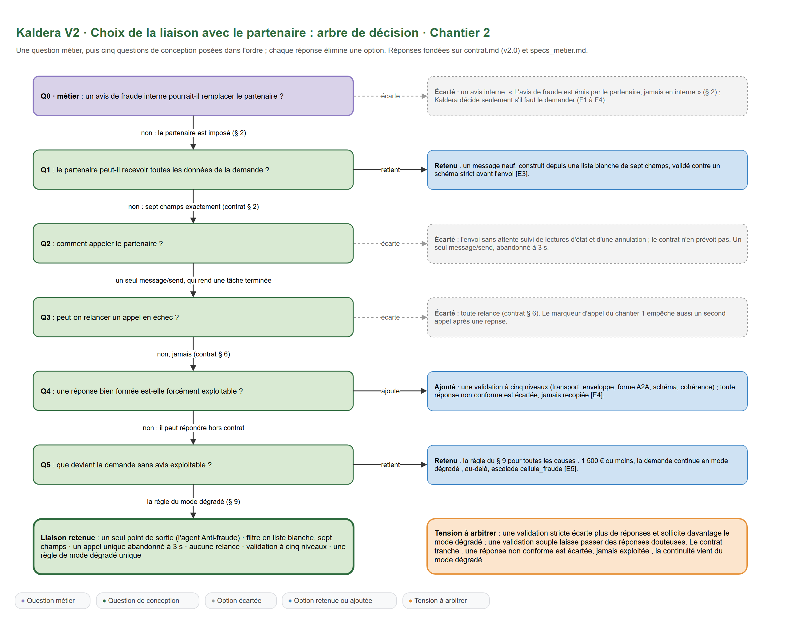
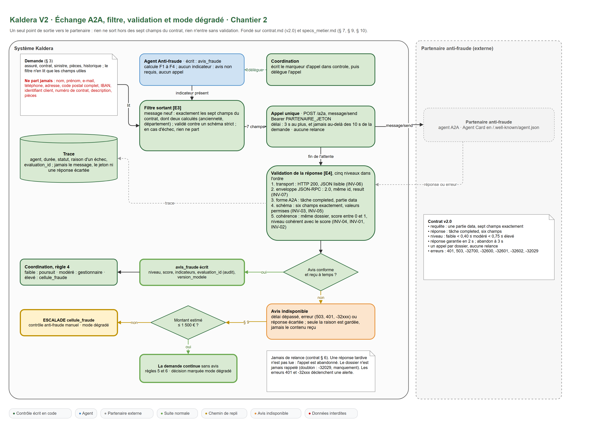

# Chantier 2 : la collaboration A2A et l'épreuve du réel

Ce que le brief attend pour ce chantier : le schéma d'échange A2A (contrat, filtre de données, validation des réponses, chemin de mode dégradé) et le plan d'épreuve (scénarios d'intégration × signaux observés × ajustement possible du chantier 1).

Exigences concernées : [E3], [E4], [E5] et [E6]. Le brief résume l'enjeu en une ligne : le partenaire peut être lent, menteur ou en panne, et le contrat doit être respecté à la lettre.

Sources : [`external_agent/contrat.md`](external_agent/contrat.md) (version 2.0), [`docs/specs_metier.md`](docs/specs_metier.md) (version 3.2), [`docs/interface.md`](docs/interface.md) et [`eval/scenarios.jsonl`](eval/scenarios.jsonl) (28 scénarios), reçus le 06/10/2026. Les renvois « contrat § » désignent les sections du contrat, les renvois « § » seuls celles de `specs_metier.md`.

Ce chantier s'appuie sur l'équipe du [chantier 1](chantier-1-equipe-orchestration.md) : l'agent **Anti-fraude** est le seul à parler au partenaire, il écrit la section `avis_fraude`, et la **Coordination** applique la règle 4 du § 10 à partir de cette section.

Démarche : comme au chantier 1, le cadrage métier (section 1) précède les choix de conception (section 2, arbre de décision) et leur détail (sections 3 à 7) ; l'épreuve vient ensuite (sections 8 et 9).

## 1. Cadrage métier de la collaboration avec le partenaire

Les documents reçus répondent à une grande partie des questions ; les autres restent à poser au client.

### Analyse de l'existant

- [ ] Comment l'agent actuel interroge-t-il le partenaire, et que se passe-t-il aujourd'hui quand celui-ci ne répond pas ?
  **Réponse en partie.** Le brief décrit le défaut : quand le partenaire ne répond pas, toute la demande reste bloquée, parfois des semaines. Le fonctionnement technique de l'agent actuel reste **ouvert**.
- [ ] Combien de demandes partent chez le partenaire, avec quel délai de réponse moyen, et quelle part de pannes ou de lenteurs ?
  **Ouvert** pour la production. Dans les scénarios, 18 demandes sur 34 requièrent un avis (section 8). Le contrat garantit une réponse en 2 s (contrat § 5).
- [x] Le partenaire a-t-il déjà renvoyé des réponses non conformes ?
  **Réponse.** Le contrat le prévoit : une réponse qui ne respecte pas ses règles « n'engage pas le partenaire » et doit être écartée (contrat § 3). Sept scénarios `invalide` en donnent les formes attendues.
- [x] Pourquoi le contrat a-t-il changé ?
  **Réponse (contrat, « Changements »).** La version 2.0 impose un schéma strict, la minimisation des données (plus d'identité, de coordonnées ni de données bancaires), la fin de toute relance et un délai garanti de 2 s.

### Expression du besoin

- [x] Le partenaire est-il indispensable, ou un contrôle interne pourrait-il le remplacer ?
  **Réponse (§ 2).** « L'avis de fraude est émis par le partenaire, jamais en interne. » Le partenaire est imposé.
- [x] Que prévoit exactement le contrat d'échange ?
  **Réponse :** voir la section 3. Sept champs exactement en entrée, six en sortie, réponse en 2 s, abandon à 3 s, un seul appel par dossier, aucune relance.
- [x] Quelles données personnelles le partenaire peut-il recevoir ?
  **Réponse (contrat § 2).** Aucune donnée d'identité, de coordonnées ni bancaire. Le département remplace l'adresse, l'ancienneté du contrat remplace la date de souscription. C'est l'application du principe de minimisation du RGPD.
- [x] Quand le partenaire est indisponible, que souhaite le métier ?
  **Réponse (§ 9).** Seules les demandes qui requièrent un avis sont concernées : montant estimé de 1 500 € ou moins, la demande continue sans avis et la décision est marquée « mode dégradé », pour contrôle a posteriori ; au-delà, escalade vers `cellule_fraude` pour un contrôle manuel.
- [x] Quel risque le métier accepte-t-il pendant une panne ?
  **Réponse (§ 9).** Indemniser sans avis jusqu'à 1 500 €, avec un contrôle a posteriori. Au-delà, un humain contrôle avant toute décision.
- [x] Que faire d'une réponse arrivée trop tard ?
  **Réponse (contrat § 5).** Un avis non reçu dans les 3 s est réputé indisponible. L'appel est abandonné : la réponse tardive n'est jamais lue, et la demande n'est jamais réévaluée par un second appel.

### Résultats attendus

- [x] Quel délai maximal d'attente du partenaire ?
  **Réponse (contrat § 5).** 3 s au plus après l'envoi, à l'intérieur des 10 s par demande (§ 12).
- [ ] Quels indicateurs suivront la collaboration, et comment le métier veut-il être alerté d'une panne prolongée ?
  **Réponse en partie.** Les métriques par agent sont fixées par `interface.md` (section 7). Les seuils d'alerte restent **ouverts**.
- [x] Quelles preuves garder en cas de litige avec le partenaire ?
  **Réponse en partie.** L'`evaluation_id` de chaque avis, « à conserver pour audit » (contrat § 3), et la trace de chaque appel (durée, statut, raison d'un rejet). La durée de conservation reste **ouverte**.

## 2. Le choix de la liaison : l'arbre de décision

Les questions se posent dans l'ordre, et chaque réponse élimine une option (voir le schéma 4).

| # | Question | Réponse | Ce qu'elle écarte ou ajoute |
|---|---|---|---|
| Q0 | Un avis de fraude interne pourrait-il remplacer le partenaire ? | Non : « l'avis de fraude est émis par le partenaire, jamais en interne » (§ 2) | Écarte : un avis interne. Kaldera ne fait que décider s'il faut demander l'avis (indicateurs F1 à F4) |
| Q1 | Le partenaire peut-il recevoir toutes les données de la demande ? | Non : sept champs exactement (contrat § 2) | Retient : un message neuf construit à partir d'une liste blanche, validé contre un schéma strict avant l'envoi [E3] |
| Q2 | Comment appeler le partenaire ? | Un seul `message/send`, qui rend une tâche terminée (contrat § 1, § 3) | Écarte : l'envoi sans attente suivi de lectures d'état et d'une annulation ; le contrat n'en prévoit pas, et chaque appel compte. Retient : un appel unique, abandonné à 3 s |
| Q3 | Peut-on relancer un appel en échec ? | Non, jamais (contrat § 6) | Écarte : toute relance. Ajoute : le marqueur d'appel du chantier 1, pour qu'une reprise après incident ne rappelle jamais le partenaire |
| Q4 | Une réponse bien formée est-elle forcément exploitable ? | Non : le partenaire peut répondre hors contrat | Ajoute : une validation à cinq niveaux ; toute réponse non conforme est écartée, jamais recopiée [E4] |
| Q5 | Que devient la demande sans avis exploitable ? | La règle du § 9 | Retient : une seule règle pour toutes les causes (délai, erreur, réponse écartée) : 1 500 € ou moins, la demande continue en mode dégradé ; au-delà, escalade `cellule_fraude` [E5] |

Liaison retenue : un seul point de sortie (l'agent Anti-fraude), un filtre en liste blanche, un appel `message/send` unique abandonné à 3 s, aucune relance, une validation à cinq niveaux et une règle de mode dégradé unique.

La tension à arbitrer : une validation stricte écarte davantage de réponses et sollicite plus souvent le mode dégradé ; une validation souple laisse passer des réponses douteuses. Le contrat tranche : une réponse non conforme « doit être écartée par le client, jamais exploitée » (contrat § 3). La continuité de service vient du mode dégradé.

## 3. Le contrat d'échange [E3] [E4]

### Ce que dit le contrat

| Rubrique | Contenu (contrat version 2.0) |
|---|---|
| Découverte | Agent Card en `GET /.well-known/agent.json` |
| Appel | `POST /a2a`, JSON-RPC 2.0, méthode `message/send` ; en-tête `Authorization: Bearer <jeton>` ; `application/json`, UTF-8 |
| Requête | une seule partie de type `data`, avec exactement sept champs obligatoires ; tout autre champ est refusé |
| Réponse | une tâche à l'état `completed`, avec un artefact `data` de six champs : `reference_dossier`, `score`, `niveau`, `indicateurs`, `evaluation_id`, `version_modele` |
| Cohérence | `faible` si score < 0,40 ; `modere` si 0,40 ≤ score < 0,75 ; `eleve` si score ≥ 0,75 ; aucun champ en plus ; même `id` JSON-RPC que la requête |
| Erreurs | HTTP 401 (jeton), HTTP 503 (indisponible), JSON-RPC `-32700`, `-32600`, `-32601`, `-32602` (données non conformes), `-32029` (dossier déjà évalué) |
| Délais | réponse garantie en 2 s ; le client abandonne au plus tard 3 s après l'envoi |
| Limites | un seul appel par dossier ; aucune relance automatique, ni après un délai dépassé, ni après une erreur, ni après une réponse écartée ; tout doublon est refusé et signalé comme manquement |

### Les questions

- [x] Quelle version du protocole A2A le partenaire suit-il ?
  **Réponse.** Le format du contrat est celui de la version 0.3.0 : méthode `message/send`, parties typées par `kind` (`data`), réponse `kind: "task"` avec `status.state`. En version 1.0.0, la méthode s'appelle `SendMessage` et le champ `kind` n'existe plus. L'emplacement de l'Agent Card est celui du contrat (`agent.json`), et non celui que recommande la version 0.3.0 (`agent-card.json`) : le contrat fait foi.
- [x] Que fait-on de l'Agent Card ?
  **Réponse.** Elle est lue une fois, au démarrage de la plateforme, et non à chaque demande : on vérifie que l'agent annonce bien l'évaluation du risque de fraude et l'authentification par jeton, et on journalise sa version. L'adresse et la méthode d'appel étant fixées par le contrat, un échec de lecture ne bloque rien : il est signalé, et chaque demande concernée tente son appel unique.
- [x] Comment relie-t-on l'appel à sa demande ?
  **Réponse.** Par `reference_dossier`, envoyé et contrôlé au retour, et par l'`id` JSON-RPC, unique pour chaque appel et contrôlé au retour. L'`evaluation_id` reçu est gardé dans `avis_fraude`.
- [x] Qui détient le jeton d'accès ?
  **Réponse.** Le seul agent Anti-fraude, qui le lit dans `PARTENAIRE_JETON` (`interface.md`). Il n'apparaît jamais dans la trace ni dans un journal.

### Exemple de requête, construite pour le scénario AF-01

Le dossier KAL-26-0201 présente l'indicateur F2 (contrat de 71 jours). Le message ne contient que les sept champs du contrat ; le nom, l'adresse, l'IBAN, l'identifiant client, le numéro de contrat, la description et les pièces de la demande restent chez Kaldera.

```json
{
  "jsonrpc": "2.0",
  "id": "c0a8012e-4f1b-4c55-9d1e-2b7e1f0e6a10",
  "method": "message/send",
  "params": {
    "message": {
      "role": "user",
      "messageId": "8d3f2a64-1c0e-4e2b-a7b5-0f6c9e1d2a33",
      "parts": [
        {
          "kind": "data",
          "data": {
            "reference_dossier": "KAL-26-0201",
            "type_sinistre": "degat_des_eaux",
            "montant_declare": 1200.0,
            "date_survenance": "2026-08-30",
            "anciennete_contrat_jours": 71,
            "sinistres_12_mois": 0,
            "departement": "13"
          }
        }
      ]
    }
  }
}
```

L'enveloppe reprend exactement celle de l'exemple du contrat. Le schéma JSON officiel de la version 0.3.0 exige en plus `"kind": "message"` dans le message ; le contrat ne le montre pas. Le premier essai contre le partenaire simulé tranchera (points ouverts).

## 4. Le filtre des données sortantes [E3]

### Où il s'applique

Dans l'agent Anti-fraude, juste avant l'appel, et nulle part ailleurs : c'est le seul point de sortie vers le partenaire. Il ne lit, dans la mémoire de la demande, que ce dont il a besoin (chantier 1, droits sur la mémoire) : il ne voit ni l'identité de l'assuré, ni son IBAN, ni le contenu des pièces.

### Les sept champs, et d'où ils viennent

| Champ envoyé | Source dans la demande (§ 3) | Règle |
|---|---|---|
| `reference_dossier` | `reference` | recopiée |
| `type_sinistre` | `sinistre.type` | recopié ; une des quatre valeurs du contrat |
| `montant_declare` | `sinistre.montant_declare` | recopié ; strictement positif |
| `date_survenance` | `sinistre.date_survenance` | recopiée ; format `AAAA-MM-JJ` |
| `anciennete_contrat_jours` | `contrat.date_souscription`, `sinistre.date_survenance` | **calculée** : jours entre les deux dates. Toujours au moins 30, puisqu'une demande non éligible n'atteint jamais le contrôle anti-fraude (carence, § 4) |
| `sinistres_12_mois` | `historique.sinistres_12_mois` | recopié |
| `departement` | `assure.code_postal` | **calculé** : les 2 premiers caractères ; pour la Corse (codes 20xxx), `2A` si le troisième chiffre est 0 ou 1, `2B` sinon ; pour l'outre-mer (codes 97xxx et 98xxx), les 3 premiers chiffres |

### Comment le filtre garantit que rien d'autre ne sort

- **Un objet neuf.** Le message est construit champ par champ à partir de cette liste blanche. On ne part jamais de la demande complète pour en retirer des champs : un champ ajouté plus tard à la demande ne passerait pas.
- **Une validation avant l'envoi.** Le message est vérifié contre un schéma strict (sept champs, types, valeurs permises, aucun champ en plus). En cas d'échec, rien ne part ; l'avis est « indisponible » avec la raison `requete_non_conforme`, et l'échec est signalé, car il révèle un défaut de notre côté.
- **Pas de valeur détournée.** Le contrat interdit aussi les données cachées dans un champ texte. Seuls deux champs sont des chaînes libres en apparence : `type_sinistre` est contrôlé contre ses quatre valeurs, `departement` contre son format. La description libre du sinistre n'est jamais lue par l'agent.
- **Des traces sans fuite.** La trace note l'appel, sa durée et son statut ; elle ne recopie ni le message ni le jeton.

### Les preuves

- Un test place dans une demande des valeurs repérables (nom, e-mail, IBAN, adresse, numéro de contrat, description) et vérifie qu'aucune n'apparaît dans le message envoyé au partenaire simulé, et que le message porte exactement sept champs.
- Un test unitaire du département : `69003` donne `69`, `20000` donne `2A`, `20200` donne `2B`, `97400` donne `974`. Aucun scénario ne couvre la Corse ni l'outre-mer : sans ce test, la règle ne serait jamais exercée.

## 5. La validation des réponses [E4]

Une réponse n'est exploitée que si elle passe les cinq niveaux, dans l'ordre. Au premier échec, elle est écartée : l'avis est « indisponible », la raison est notée, et rien du contenu reçu n'entre dans la demande (« ni recopiée dans le dossier », § 7).

| Niveau | Ce qu'on vérifie | Scénario qui l'éprouve |
|---|---|---|
| 1. Transport | HTTP 200 ; corps JSON lisible | INV-06 (page HTML) |
| 2. Enveloppe JSON-RPC | `jsonrpc` vaut `"2.0"` ; même `id` que la requête ; `result` ou `error`, un seul des deux | INV-07 (enveloppe non conforme) |
| 3. Forme A2A | `result.kind` vaut `"task"` ; `status.state` vaut `"completed"` ; un artefact portant une partie `data` | (aucun scénario dédié) |
| 4. Schéma des données | exactement les six champs, avec leurs types ; `niveau` parmi trois valeurs ; `indicateurs` parmi quatre valeurs | INV-03 (champs hors contrat), INV-05 (niveau absent) |
| 5. Cohérence | `reference_dossier` identique à celle envoyée ; `score` entre 0 et 1 ; `niveau` cohérent avec `score` | INV-04 (autre dossier), INV-01 (score hors bornes), INV-02 (niveau incohérent) |

### Les questions

- [x] Comment valide-t-on une réponse avant de la croire ?
  **Réponse :** par les cinq niveaux ci-dessus. Les niveaux 1 à 4 contrôlent la forme ; le niveau 5 contrôle la plausibilité : une réponse bien formée qui porte sur un autre dossier, ou dont le niveau contredit le score, est écartée.
- [x] Que fait-on d'une erreur du partenaire ?
  **Réponse.** Jamais de relance (contrat § 6) : l'avis est « indisponible » et la règle du mode dégradé s'applique. Certaines erreurs révèlent en plus un défaut de notre côté et déclenchent une alerte technique.

| Erreur reçue | Signification | Réaction |
|---|---|---|
| délai de 3 s dépassé | partenaire lent ou injoignable | indisponible, raison `delai_depasse` |
| HTTP 503 | partenaire hors service | indisponible, raison `service_indisponible` |
| HTTP 401 | jeton absent ou invalide | indisponible, et **alerte** : configuration du jeton à corriger |
| `-32700`, `-32600`, `-32601`, `-32602` | requête illisible ou non conforme | indisponible, et **alerte** : notre requête est fautive, le filtre est à revoir |
| `-32029` | dossier déjà évalué | indisponible, et **alerte** : un doublon est un manquement au contrat, il ne doit jamais arriver |

- [x] Que garde-t-on d'une réponse valide ?
  **Réponse.** Dans `avis_fraude` : niveau, score, indicateurs, `evaluation_id` et `version_modele`. La fiche de décision n'en reprend que `niveau` et `score` (§ 11).
- [x] Que garde-t-on d'une réponse écartée ?
  **Réponse.** Seulement la raison : le niveau de validation en échec et le contrôle en cause (par exemple `coherence:niveau_incoherent`). Jamais le contenu reçu. La fiche porte `avis_fraude: null` et `mode_degrade: true`.

## 6. Le mode dégradé [E5]

### La règle du métier (§ 9)

Le partenaire est « indisponible » pour une demande quand son avis n'a pas pu être obtenu : délai dépassé, erreur du service, ou réponse non conforme. Dans ce cas, et **uniquement pour les demandes qui requièrent un contrôle anti-fraude** :

| Montant estimé | Issue | Fiche |
|---|---|---|
| 1 500 € ou moins | la demande continue sans avis et reçoit sa décision selon les autres règles (règles 5 et 6) | `mode_degrade: true`, pour contrôle a posteriori |
| plus de 1 500 € | escalade vers `cellule_fraude`, motif « contrôle anti-fraude manuel » | `mode_degrade: true` |

Les demandes sans indicateur ne sont pas concernées : elles n'appellent jamais le partenaire, et sa panne ne les touche pas.

### Exemple : le lot de cinq demandes de PAN-01, partenaire hors service

| Dossier | Ce qui se passe | Issue attendue |
|---|---|---|
| KAL-26-0401 | aucun indicateur, aucun appel | acceptée 830 €, sans mode dégradé |
| KAL-26-0402 | bris de glace sur une formule essentiel : non éligible (règle 1), aucun appel | refusée |
| KAL-26-0403 | contrat de moins de 90 jours (F2) ; appel en échec ; 1 350 € estimés | acceptée 1 350 €, mode dégradé |
| KAL-26-0404 | 8 800 € déclarés (F1) ; appel en échec ; plus de 1 500 € | escalade `cellule_fraude`, mode dégradé |
| KAL-26-0405 | photo déposée après un complément ; aucun indicateur, aucun appel | acceptée 700 €, sans mode dégradé |

### Les questions

- [x] Comment l'implémente-t-on sans bloquer le reste ?
  **Réponse.** Trois mécanismes. L'appel est abandonné au plus tard à 3 s, et jamais après la fin des 10 s de la demande : son délai est le plus petit de 3 s et du temps restant, moins la réserve gardée pour produire la fiche. Les demandes d'un lot sont traitées en concurrence (chantier 1, section 4) : une demande qui attend le partenaire ne retarde pas les autres. Enfin, une demande sans indicateur n'appelle jamais le partenaire.
- [x] Qui applique la règle ?
  **Réponse.** L'agent Anti-fraude écrit « indisponible » et la raison dans `avis_fraude` ; la Coordination applique la règle 4 du § 10, donc le § 9. La frontière du chantier 1 reste intacte : l'agent Anti-fraude ne conclut jamais la demande.
- [x] Y a-t-il un disjoncteur pour cesser d'appeler un partenaire en panne ?
  **Réponse : non, par choix.** Chaque dossier n'a droit qu'à un appel, et une panne coûte au plus 3 s à la demande concernée, sans toucher les autres. Ne pas appeler priverait une demande d'un avis que le partenaire, revenu, aurait pu rendre. Si l'épreuve montrait le contraire, la décision serait consignée au journal des ajustements (section 9).
- [x] Que devient une réponse qui arrive après l'abandon ?
  **Réponse.** Elle n'est jamais lue : la connexion est fermée à l'abandon. Le partenaire a pu évaluer le dossier de son côté, mais Kaldera ne le rappelle jamais (`-32029`). La demande garde l'issue du mode dégradé ; le contrôle a posteriori ou la cellule anti-fraude prennent le relais.

## 7. L'observabilité et le monitorage [E6]

### Les signaux par agent (`interface.md`)

`traiter_lot` renvoie, pour chaque agent nommé dans la trace (`coordination`, `eligibilite`, `pieces`, `estimation`, `antifraude`) :

| Métrique | Ce qu'elle compte | Ce qu'on en attend pour l'agent `antifraude` |
|---|---|---|
| `appels` | étapes réalisées | une par demande éligible, aux pièces complètes et au montant non nul |
| `echecs` | erreur, délai dépassé, réponse écartée | autant que de demandes en mode dégradé |
| `latence_ms` | durée moyenne d'une étape | quelques millisecondes sans appel ; au plus 3 000 ms avec appel |
| `appels_externes` | appels au partenaire | jamais plus d'un par dossier ; 18 sur l'ensemble des 28 scénarios |

### Les signaux de l'équipe

- les étapes consommées par demande, comparées à `etapes_max` ;
- les bornes atteintes (`arret`) ;
- la répartition des issues : décisions, escalades `gestionnaire`, escalades `cellule_fraude` ;
- la part des demandes en mode dégradé, et ses raisons (`delai_depasse`, `service_indisponible`, `reponse_ecartee`…) ;
- la durée de chaque demande et la durée totale d'un lot.

### Où ils sont visibles

Dans le retour de `traiter_lot` (métriques) et dans la fiche de chaque demande (trace, `arret`, `mode_degrade`). Le script de rejeu des scénarios produit un rapport par exécution, rangé avec le journal des ajustements : c'est la preuve chiffrée de chaque ajustement.

- [x] Quels signaux monitore-t-on par agent ?
  **Réponse :** les quatre métriques de `interface.md`, plus les étapes consommées par demande au niveau de la Coordination.
- [x] Comment montrer qu'une demande a suivi le bon chemin ?
  **Réponse.** Par sa trace (agent et sections écrites à chaque étape), comparée au chemin attendu par les règles du § 10 ; pour l'agent Anti-fraude, la trace dit en plus s'il y a eu appel, sa durée et la raison d'un échec.

## 8. Le plan d'épreuve [E6]

### Ce qu'on teste : une équipe, pas un agent isolé

Un test d'intégration soumet chaque scénario de `eval/scenarios.jsonl` à `traiter_lot`, avec le partenaire simulé réglé selon le champ `partenaire` du scénario (`normal`, `lent`, `invalide`, `panne`), et compare chaque fiche au champ `attendu`. Il observe les métriques et la trace, pas seulement l'issue. Le partenaire simulé se pilote avec `scripts/partner_ctl.py`, pas encore reçu ; en attendant, un bouchon local reproduit les quatre comportements.

Le chemin de décision ne contient aucun LLM et le partenaire simulé est déterministe : un rejeu suffit pour juger une issue. Seules les durées varient d'une exécution à l'autre ; les scénarios `panne` sont donc rejoués cinq fois pour mesurer les temps.

### Scénarios × signaux × ajustements

| Scénarios | Exigences | Signaux observés | Critère de réussite | Ajustement possible du chantier 1 |
|---|---|---|---|---|
| NOM-01 à NOM-11 (nominaux) | [E1] [E2] | issue, trace (agent, `ecrit`), étapes, appels externes | 11 fiches conformes à `attendu` ; chaque section écrite par son seul propriétaire ; 0 appel au partenaire | frontière (droits d'écriture), `etapes_max` |
| AF-01 à AF-07 (anti-fraude) | [E1] [E3] | appels externes, échecs, message envoyé, `avis_fraude` | 7 appels, 0 échec ; 7 messages de sept champs exactement ; niveau d'avis et issue conformes (AF-03 : avis faible mais plus de 10 000 €, donc escalade) | routage des règles 4 et 5 |
| INV-01 à INV-07 (réponses invalides) | [E4] [E5] | échecs et leur raison, `avis_fraude`, `mode_degrade` | 7 appels, 7 réponses écartées, chacune au bon niveau de validation ; aucun avis recopié ; 1 500 € ou moins acceptées en mode dégradé (INV-01, 03, 05, 06), au-delà escalade `cellule_fraude` (INV-02, 04, 07) | règles de validation |
| PAN-01 (partenaire en panne, lot de 5) | [E5] [E6] | appels externes, échecs, issues du lot | 2 appels (0403, 0404), 2 échecs, aucune relance ; 0401 et 0405 non touchés ; 5 fiches conformes | routage du mode dégradé |
| PAN-02 (partenaire lent à 5 s, lot de 3) | [E5] [E6] | durée de chaque appel, de chaque demande et du lot | 2 appels abandonnés à 3 s ; 0501 sans attente ; chaque demande sous 10 s ; le lot dure environ 3 s, et non 6 s | `duree_max_s` (10 s ou 8 s), traitement du lot en concurrence |
| BCL-01 (piège à boucle) | [E1] [E6] | longueur de la trace, `arret` | escalade avec `arret` ; trace de 8 étapes au plus | `etapes_max`, borne « même état », file de l'escalade sur borne |

### Ce que les scénarios ne couvrent pas, et que des tests unitaires couvrent

| Test | Ce qu'il prouve |
|---|---|
| données sensibles placées dans la demande | aucune ne sort ; sept champs exactement [E3] |
| département de la Corse et de l'outre-mer | `2A`, `2B`, trois chiffres |
| réponses 401, 503, `-32602`, `-32029` | indisponible, alerte quand il le faut, un seul appel |
| tâche à l'état non terminé, ou sans partie `data` | réponse écartée au niveau 3 |
| reprise avec marqueur d'appel et sans avis | avis indisponible, aucun nouvel appel |
| ensemble des 28 scénarios | jamais plus d'un appel par dossier, 18 au total |

## 9. Le journal des ajustements [E6]

Le brief exige que chaque ajustement de l'orchestration provoqué par un scénario d'épreuve soit consigné, et que les bornes et frontières finales soient justifiées par les scénarios rejoués.

### Comment un ajustement est décidé

1. Un scénario échoue, ou un signal sort de son critère (par exemple une demande de PAN-02 qui dépasse 10 s).
2. On identifie l'élément du chantier 1 en cause : une borne, une frontière ou un routage.
3. On change **un seul** élément à la fois.
4. On rejoue les 28 scénarios et les tests unitaires, pour vérifier que rien d'autre n'a cassé.
5. On consigne une ligne au journal, avec le rapport de rejeu avant et après, et la référence du commit.

Ajustements déjà repérés comme possibles, à décider uniquement sur mesure : `duree_max_s` de 10 à 8 s si produire la fiche d'une demande arrêtée dépasse l'engagement ; `etapes_max` si BCL-01 montre une marge inutile ou insuffisante ; la file de l'escalade sur borne atteinte si le client en désigne une autre.

### Le journal

Il sera tenu pendant le développement dans `docs/journal-ajustements.md`, une ligne par ajustement :

| Date | Scénario rejoué | Signal observé | Élément ajusté (borne, frontière ou routage) | Valeur avant | Valeur après | Résultat du rejeu | Commit |
|---|---|---|---|---|---|---|---|
| | | | | | | | |

## Points ouverts

| Point | Pourquoi il reste ouvert | Qui tranche |
|---|---|---|
| `"kind": "message"` dans la requête | exigé par le schéma A2A 0.3.0, absent de l'exemple du contrat | le premier essai contre le partenaire simulé |
| Seuils d'alerte (taux de mode dégradé, panne prolongée) | ni la spec ni le contrat ne les fixent | le client |
| Durée de conservation des `evaluation_id` et des traces | non fixée | le client |
| Département des codes postaux corses | la règle du troisième chiffre est la règle usuelle ; le contrat ne détaille pas le calcul | le partenaire |
| Pilote du partenaire simulé (`scripts/partner_ctl.py`) et tests d'acceptance | cités par `interface.md`, absents de l'archive | le formateur |

## Hors brief, mais réel

- [x] Une pièce justificative peut-elle contenir une injection de prompt ?
  **Réponse.** Pas dans cette conception : aucun LLM ne lit les pièces ni la description, et rien de ce que le partenaire renvoie n'est donné à un modèle. Le risque reviendrait si un LLM rédigeait un jour le motif de la fiche : il ne recevrait alors que des champs validés, jamais un texte libre.

## Schémas

Fondés sur `contrat.md` (version 2.0), `specs_metier.md` (version 3.2) et les 28 scénarios. Chaque schéma existe en `.drawio`, modifiable sur [app.diagrams.net](https://app.diagrams.net/), et en `.png`. Ils se régénèrent avec `scripts/make_schemas_ch2.py`.

### 4. Le choix de la liaison : l'arbre de décision

Une question métier (Q0), puis cinq questions de conception posées dans l'ordre ; chaque réponse élimine une option, jusqu'à la liaison retenue. Fichiers : [schema-4-arbre-liaison-a2a.drawio](schemas/schema-4-arbre-liaison-a2a.drawio), [PNG](schemas/schema-4-arbre-liaison-a2a.png).



### 5. L'échange A2A, le filtre, la validation et le chemin de mode dégradé

Un seul point de sortie vers le partenaire ; sept champs exactement ; un appel unique abandonné à 3 s ; une validation à cinq niveaux ; sans avis exploitable, la règle du § 9. Fichiers : [schema-5-echange-a2a.drawio](schemas/schema-5-echange-a2a.drawio), [PNG](schemas/schema-5-echange-a2a.png).



### 6. Le plan d'épreuve

La boucle rejouer, observer, comparer, ajuster, consigner, puis le tableau des familles de scénarios × signaux × critères × ajustements du chantier 1. Fichiers : [schema-6-plan-epreuve.drawio](schemas/schema-6-plan-epreuve.drawio), [PNG](schemas/schema-6-plan-epreuve.png).


